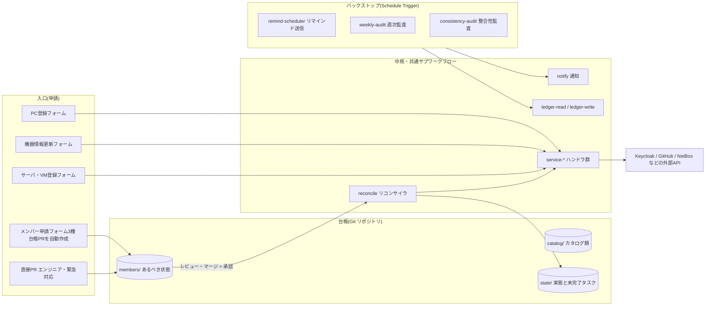

# 00. 全体像 — スコープと役割分担

## 背景と目的

開発プロジェクト(n8n中心)の運用のうち、次の3領域を n8n で自動化し、対応漏れをなくす。

1. **メンバーライフサイクル管理** — メンバーの追加・役割変更・削除。
   SAML/SSO ではカバーできない個別サービスの操作を n8n が担う。
2. **開発PC登録時のタスク管理** — 新規購入・他部署からの搬入を問わず、
   コンピュータ名・資産管理番号の記録(手入力。情シス採番前は仮の値で先行し、
   正式化を追跡)、NetBox への登録、必須ソフトのライセンス購入リマインド、
   IP アドレスの回収を登録起点で促し、漏れを防ぐ。
3. **サーバ・VM の一覧と IP の管理** — 物理サーバ(直接 OS / ハイパーバイザー)
   と VM を NetBox で一元管理する。n8n は登録の入口・仮情報の正式化・
   実態との突合を担う。

### 前提: IdP の位置づけ

- このプロジェクトの IdP(**Keycloak**)は**プロジェクト自身が保有・管理**し、
  従業員と協力会社メンバーの両方が登録される。
- HR・社内情シスが管理する全社 IdP は**別系統**で、協力会社メンバーは登録されない。
- したがって本自動化では、**プロジェクト IdP のユーザーライフサイクル自体を
  管理対象に含める**(サービスカタログの1行として `execute: api` で扱う)。
  協力会社メンバーにとっては、このフローが事実上の入退場処理となる。
- 従業員の退職は全社 IdP・HR 側で先に起こり、プロジェクト IdP には自動伝播しない。
  この検知の手当てを削除フローと監査に組み込む(→ [01](01-member-lifecycle.md))。

## SAML/SSO と n8n の役割分担

| 操作 | 担当 | 備考 |
|---|---|---|
| 認証・シングルサインオン | SAML/SSO(IdP) | SSO対応SaaSへのログイン |
| SSO対応SaaSのアカウント作成 | JIT プロビジョニング(初回 SSO ログイン時) | Keycloak は SCIM を標準では持たないため。停止は Keycloak アカウント停止で実質無効化される |
| プロジェクト IdP のユーザー作成・変更・停止 | **n8n(API)** | IdP はプロジェクト保有のため、ユーザーライフサイクル自体を本フローが管理(上記前提) |
| GitHub Organization への招待・削除、Team 所属 | **n8n(API)** | SSOログインはできても Org/Team 所属は別管理 |
| 有償ライセンスのシート購入・解約(JetBrains 等) | **n8n(手動タスク+リマインド)** | 購入・契約はAPI化が困難。漏れ防止が主目的 |
| Claude アカウントの追加・削除 | **n8n(当面は手動タスク)** | Anthropic Admin API 導入で自動化へ昇格可能 |
| NetBox へのデバイス登録・アカウント管理 | **n8n(API)** | PC登録フローの中核 |
| PC登録時のチェックリスト(仮情報の正式化・NetBox登録・ライセンス) | **n8n** | SAMLとは無関係の運用タスク |

IdP は **Keycloak** に確定。コネクタは Keycloak Admin REST API を使う
(ユーザー作成・グループ所属・停止。→ [05](05-environment.md))。
Keycloak は SCIM を標準では持たないため、SSO 対応 SaaS 側のアカウント作成は
初回 SSO ログイン時の JIT プロビジョニングを基本とし、SCIM が必要になったら
拡張の導入を検討する。IdP 経由のカバー範囲が広がったら、該当サービスを
[サービスカタログ](03-service-catalog.md)で `execute: idp` に変えるだけでよい。

## 基本方針(5原則)

1. **自動化できる部分は自動実行、できない部分はタスク化+リマインドで漏れを防ぐ**
   サービスとの連携形態は、操作(追加・変更・削除)ごとに
   **実行方式 × 確認方式 × 枠** の3軸で分類する。SCIM/SAMLで完結、APIで自動実行、
   枠の手動調達+自動割当、管理者への依頼+APIでの事後把握……は、
   すべてこの3軸の組み合わせとして表せる。実行が人手でも確認(事後検証)だけを
   自動化して漏れ検出を効かせる、といった分担がとれるのがポイント。
   → [03. サービスカタログ「分類の3軸」](03-service-catalog.md#分類の3軸)
2. **対象サービスはコードではなくデータで管理**
   サービスの増減はカタログ(データ)の行の追加・無効化で対応し、
   入口ワークフローの改修を不要にする。→ [03. サービスカタログ](03-service-catalog.md)
3. **通知・承認チャネルは抽象化**
   `notify` / `request-approval` を汎用サブワークフローとして切り出し、
   Gmail / Slack 等の実装は後から差し替え可能にする。→ [04. 通知・承認の抽象化](04-notification-abstraction.md)
4. **Git 台帳による宣言的な状態管理とバックストップ監査**
   台帳は Git リポジトリで持つ。あるべき状態(`members/`)を人が PR で宣言し、
   実態(`state/`)をリコンサイラが収束・記録する。desired ≠ state の差分が
   そのまま「やり残し」として可視化され、定期監査が未収束・期限超過・
   実サービスとの不整合を検出して通知する。フロー単体の成功に頼らず、
   二重に漏れを防ぐ。→ [03. 台帳リポジトリ](03-service-catalog.md#台帳リポジトリgit)
5. **承認を挟む(申請者と承認者の分離)**
   権限付与・剥奪・削除は必ず承認ステップを通す。メンバー系の承認は
   台帳 PR のレビュー+マージとして実装する(→ [01](01-member-lifecycle.md))。
   承認は原則1名で、復旧が困難な方向(`admin` 付与)のみ2名とする。
6. **失敗の倒れる方向を設計し、自動化の特権を自覚する**
   どの失敗が fail-open(アクセスが残る)に倒れるかを一覧で明示し、
   受容したリスクは監査で補う。**n8n 自体が承認プロセスを迂回できる特権点**
   であることを前提に、ワークフロー定義の監査・bot の書き込み範囲の強制・
   リコンサイラのサーキットブレーカー・監視の監視を置く。
   → [08. 統制と安全装置](08-safeguards.md)

## ワークフロー全体マップ

## ワークフロー一覧

実装済みのものだけを挙げる。ノード構成・データの受け渡し・実装の決まりごとは
[09. ワークフロー実装](09-workflows.md)。

| ワークフロー | 種別 | トリガー | 概要 | 詳細 |
|---|---|---|---|---|
| reconcile | 中核 | サブ(cron-daily から) | 台帳の desired と state の差分を計算し、付与・剥奪を収束させる。ドライラン可 | [01](01-member-lifecycle.md) |
| service-keycloak | コネクタ | サブ | Keycloak のユーザー作成・グループ・停止・セッション失効 | [03](03-service-catalog.md) |
| ledger-read / ledger-write / ledger-delete | サブ | サブ | 台帳アクセスの一元化(楽観的排他と再試行を含む) | [03](03-service-catalog.md) |
| notify | サブ | サブ | チャネル非依存の通知 | [04](04-notification-abstraction.md) |
| request-approval | サブ | サブ | 承認リンク方式の依頼(汎用。メンバー系の承認は台帳 PR) | [04](04-notification-abstraction.md) |
| remind-scheduler | 定期 | サブ / Webhook | 未完了タスクの催促・エスカレーション、事後検証による自動クローズ、契約期限の監視 | [04](04-notification-abstraction.md) |
| task-complete | 入口 | Webhook | 完了リンクの受け口。タスクを閉じて grant を記録 | [04](04-notification-abstraction.md) |
| pc-register | 入口 | Webhook / サブ | PC登録(新規購入・搬入)。NetBox 登録とタスク起票 | [02](02-pc-register.md) |
| device-update | 入口 | Webhook / サブ | 機器情報の更新(仮情報の正式化・IP登録) | [02](02-pc-register.md) |
| netbox-assign-ip | サブ | サブ | インターフェース作成 → IP 登録 → primary_ip4 設定 | [02](02-pc-register.md) |
| weekly-audit | 定期 | サブ / Webhook | やり残し(未収束・期限超過・滞留)のレポート | [01](01-member-lifecycle.md) |
| consistency-audit | 定期 | サブ / Webhook | 台帳と実サービスの突合。検出のみで自動是正しない | [08](08-safeguards.md) |
| cron-daily / cron-weekly | 定期 | Schedule | 日次: reconcile → remind-scheduler → 高リスク監査 / 週次: weekly-audit → 全項目監査 | [09](09-workflows.md) |

**未実装**: `service-github`(Organization が必要)、`server-register` / `vm-register` /
`hypervisor-sync`(→ [07](07-servers.md))、`recertification` / `heartbeat` /
`workflow-export-audit`(→ [08](08-safeguards.md))、メンバー申請フォーム
(現状は台帳へ直接 PR)。

## ドキュメント構成

- [01. メンバーライフサイクル](01-member-lifecycle.md)
- [02. 開発PC登録フロー](02-pc-register.md)
- [03. サービスカタログと台帳](03-service-catalog.md)
- [04. 通知・承認の抽象化](04-notification-abstraction.md)
- [05. 実行環境設計](05-environment.md)
- [06. GitHub(GHEC)連携設計](06-github-teams.md)
- [07. サーバ・VM 管理設計](07-servers.md)
- [08. 統制と安全装置](08-safeguards.md)
- [09. ワークフロー実装](09-workflows.md)
