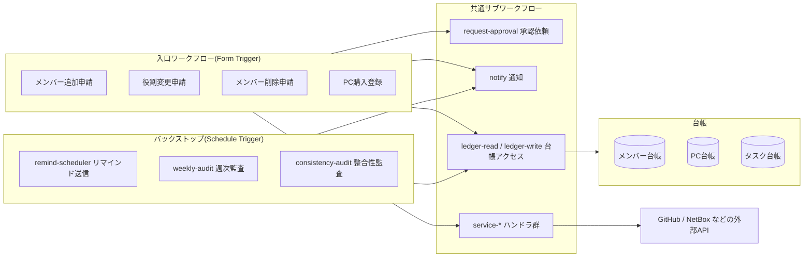

# 00. 全体像 — スコープと役割分担

## 背景と目的

開発プロジェクト(n8n中心)の運用のうち、次の2領域を n8n で自動化し、対応漏れをなくす。

1. **メンバーライフサイクル管理** — メンバーの追加・役割変更・削除。
   SAML/SSO ではカバーできない個別サービスの操作を n8n が担う。
2. **開発PC購入時のタスク管理** — マシン名の決定、NetBox への登録、
   必須ソフトのライセンス購入リマインドを申請起点で促し、漏れを防ぐ。

## SAML/SSO と n8n の役割分担

| 操作 | 担当 | 備考 |
|---|---|---|
| 認証・シングルサインオン | SAML/SSO(IdP) | SSO対応SaaSへのログイン |
| SSO対応SaaSのアカウント作成・停止 | IdP(SCIM対応時) | IdP側のグループ操作で完結する範囲 |
| GitHub Organization への招待・削除、Team 所属 | **n8n(API)** | SSOログインはできても Org/Team 所属は別管理 |
| 有償ライセンスのシート購入・解約(JetBrains 等) | **n8n(手動タスク+リマインド)** | 購入・契約はAPI化が困難。漏れ防止が主目的 |
| Claude アカウントの追加・削除 | **n8n(当面は手動タスク)** | Anthropic Admin API 導入で自動化へ昇格可能 |
| NetBox へのデバイス登録・アカウント管理 | **n8n(API)** | PC購入フローの中核 |
| PC購入時のチェックリスト(命名・登録・ライセンス) | **n8n** | SAMLとは無関係の運用タスク |

この設計は **IdP の種類に依存しない**。将来 IdP + SCIM のカバー範囲が広がったら、
該当サービスを[サービスカタログ](03-service-catalog.md)から無効化するだけでよい。

## 基本方針(5原則)

1. **自動化できる部分は自動実行、できない部分はタスク化+リマインドで漏れを防ぐ**
   サービスとの連携形態は、操作(追加・変更・削除)ごとに
   **実行方式 × 確認方式 × 枠** の3軸で分類する。SCIM/SAMLで完結、APIで自動実行、
   枠の手動調達+自動割当、管理者への依頼+APIでの事後把握……は、
   すべてこの3軸の組み合わせとして表せる。実行が人手でも確認(事後検証)だけを
   自動化して漏れ検出を効かせる、といった分担がとれるのがポイント。
   → [03. サービスカタログ「分類の3軸」](03-service-catalog.md#分類の3軸)
2. **対象サービスはコードではなくデータで管理**
   サービスの増減はカタログ(データ)の行の追加・無効化で対応し、
   入口ワークフローの改修を不要にする。→ [03. サービスカタログ](03-service-catalog.md)
3. **通知・承認チャネルは抽象化**
   `notify` / `request-approval` を汎用サブワークフローとして切り出し、
   Gmail / Slack 等の実装は後から差し替え可能にする。→ [04. 通知・承認の抽象化](04-notification-abstraction.md)
4. **台帳による状態管理とバックストップ監査**
   メンバー・PC・タスクの3台帳で状態を持ち、定期実行の監査ワークフローが
   未完了・期限超過・実サービスとの不整合を検出して通知する。
   フロー単体の成功に頼らず、二重に漏れを防ぐ。
5. **承認を挟む(申請者と承認者の分離)**
   権限付与・剥奪・削除は必ず承認ステップを通す。

## ワークフロー全体マップ

## ワークフロー一覧

| ワークフロー | 種別 | トリガー | 概要 | 詳細 |
|---|---|---|---|---|
| member-add | 入口 | Form | メンバー追加申請の受付〜プロビジョニング | [01](01-member-lifecycle.md) |
| member-change-role | 入口 | Form | 役割変更。新旧役割の差分を適用 | [01](01-member-lifecycle.md) |
| member-remove | 入口 | Form | メンバー削除。全サービス棚卸し+剥奪 | [01](01-member-lifecycle.md) |
| pc-purchase | 入口 | Form | PC購入登録。命名・NetBox登録・ライセンスタスク | [02](02-pc-purchase.md) |
| request-approval | サブ | Execute Workflow | チャネル非依存の承認依頼 | [04](04-notification-abstraction.md) |
| notify | サブ | Execute Workflow | チャネル非依存の通知 | [04](04-notification-abstraction.md) |
| ledger-read / ledger-write | サブ | Execute Workflow | 台帳アクセスの一元化 | [03](03-service-catalog.md) |
| service-github ほか | サブ | Execute Workflow | 自動実行系ハンドラ(コネクタ / PR生成 / 準備物生成) | [03](03-service-catalog.md) |
| remind-scheduler | 定期 | Schedule(毎日) | 未完了タスクへのリマインド・エスカレーション | [04](04-notification-abstraction.md) |
| weekly-audit | 定期 | Schedule(週次) | 未完了・期限超過の集計レポート | [01](01-member-lifecycle.md) / [02](02-pc-purchase.md) |
| consistency-audit | 定期 | Schedule(週次) | 実サービス(GitHub等)と台帳の突合 | [01](01-member-lifecycle.md) |

## ドキュメント構成

- [01. メンバーライフサイクル](01-member-lifecycle.md)
- [02. 開発PC購入フロー](02-pc-purchase.md)
- [03. サービスカタログと台帳](03-service-catalog.md)
- [04. 通知・承認の抽象化](04-notification-abstraction.md)
- [05. 実行環境設計](05-environment.md)
