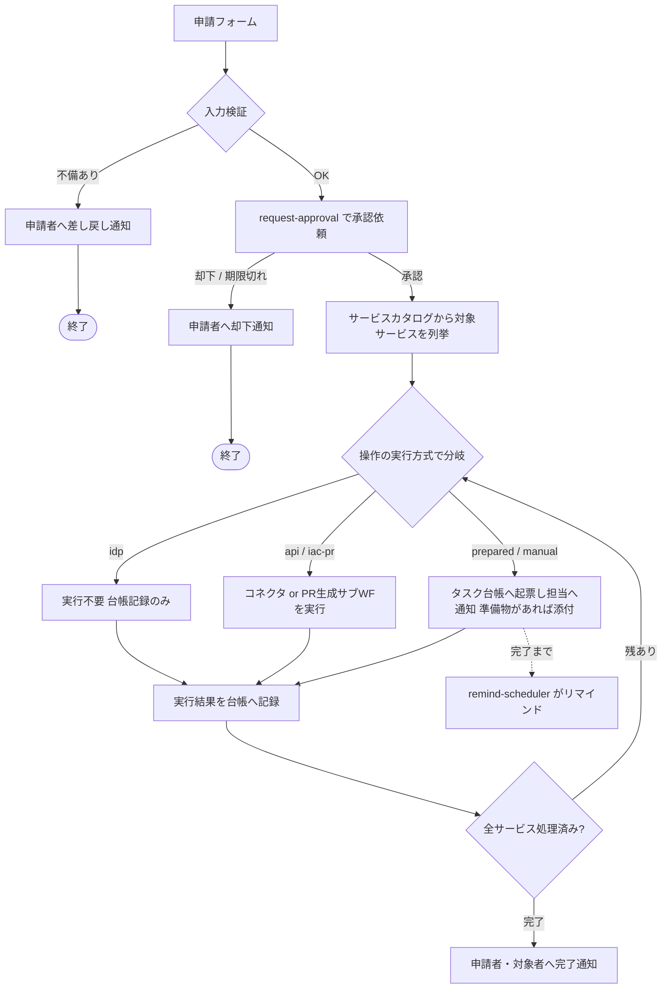
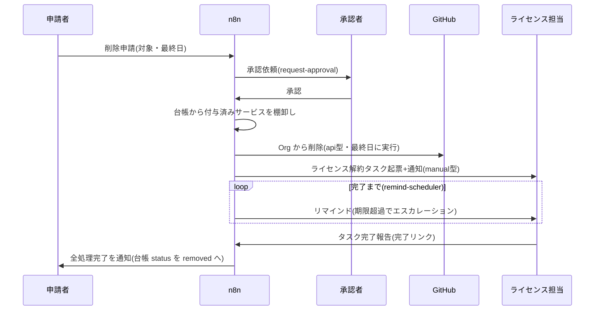

# 01. メンバーライフサイクル — 追加・役割変更・削除

3フロー(追加 / 役割変更 / 削除)は同じパイプラインを共有し、
「対象サービスの列挙」と「各サービスへの操作内容」だけが異なる。

## 共通パイプライン

- 実行方式が `api` / `iac-pr` の操作は即時実行して結果を記録する。
  `prepared` / `manual` は**タスク台帳への起票までがこのフローの責務**で、
  完了確認とリマインドは remind-scheduler([04](04-notification-abstraction.md))が
  台帳を走査して行う。確認方式が `api` / `event` のタスクは事後検証で
  自動クローズされ、人の完了報告を待たない。
  入口フローの実行が何日もぶら下がらないようにするための分担。
- 枠(capacity)管理対象のサービスで空き枠がない場合は、調達タスクを起票して
  割当を「予約」にし、充足後に再開する(→ [03「軸3: 枠」](03-service-catalog.md#軸3-枠capacity))。

## フォーム項目

| フロー | 項目 |
|---|---|
| 追加 | 氏名 / メールアドレス / 役割(ドロップダウン) / 所属プロジェクト / 開始日 / サービス固有ID(GitHubユーザー名等、必要なもののみ) / 備考 |
| 役割変更 | 対象メールアドレス / 新しい役割 / 変更理由(必須) / 適用日 |
| 削除 | 対象メールアドレス / 最終日 / 理由 |

サービス固有の識別子(GitHub ユーザー名など)は追加時に**メンバー台帳の
`service_accounts`** に保存し、役割変更・削除ではフォーム入力ではなく台帳から引く。
毎回の手入力をなくし、入力ミスによる誤操作(別人の削除など)を防ぐ。

## 追加フロー(member-add)

1. 申請を検証(メール形式、役割がマトリクスに存在するか、台帳に重複がないか)。
2. 承認後、[役割マトリクス](03-service-catalog.md#役割マトリクス)から
   役割に応じた各サービスの付与内容(grant)を決定。
3. 実行方式が自動の操作(`api` / `iac-pr`): ハンドラ実行(例: GitHub Org 招待 + Team 所属)。
4. 人手の操作(`prepared` / `manual`): タスク起票(例: JetBrains シート購入、
   Claude アカウント招待)。枠管理対象は空き枠を確認し、なければ調達タスクを先行起票。
5. メンバー台帳へ登録。status は `provisioning` で開始し、
   全タスク完了時に remind-scheduler が `active` へ更新する。

## 役割変更フロー(member-change-role)

1. 台帳から現在の役割を取得し、新役割との**マトリクス差分**を計算する。
   - 付与セット(新) − 付与セット(旧) = 追加する権限
   - 付与セット(旧) − 付与セット(新) = 剥奪する権限
2. 差分の内容(特に剥奪)を承認依頼の本文に明記して承認を取る。
3. 差分のみを各サービスに適用(実行方式に応じて即時実行またはタスク化)。
4. 台帳の役割を更新し、変更履歴を残す。

適用日が未来の場合は、承認後にタスク台帳へ「予約」として起票し、
remind-scheduler が適用日に実行を促す(入口フローで Wait し続けない)。

## 削除フロー(member-remove)

削除は漏れの影響が最も大きい(アクセス残留・課金継続)ため、
**役割マトリクスに頼らず全数棚卸し**する。

1. 承認後、対象サービスは次の和集合で列挙する:
   - メンバー台帳の `service_accounts` に付与記録があるサービス(確実に剥奪)
   - カタログ上有効で**確認方式が `human` / `none` の全サービス**(記録漏れに
     備えた確認タスク。「対象者のアカウントが残っていないか確認し、あれば解約」
     という形で起票)。確認方式が `api` / `event` のサービスは事後検証・突合で
     残留を自動検出できるため、確認タスクは不要。
2. 実行方式が自動の操作(`api` / `iac-pr`): 剥奪を実行(例: GitHub Org からの削除)。
   サービス側が自動失効させる時限付与は、失効の確認のみを行う。
3. 人手の操作(`prepared` / `manual`): 解約・削除タスクを起票。**期限は最終日**とする。
   枠管理対象は割当解放で空き枠が戻ったことも確認する。
4. 台帳 status を `offboarding` にし、全タスク完了で `removed` へ。
5. 最終日より前に申請された場合、自動実行の剥奪も「予約タスク」として起票し、
   最終日に実行する(在籍中のアクセスを止めない)。

## 失敗時の扱い

- 成功条件は「全サービスの成功」ではなく **「全サービスの結果が台帳に記録済み」**。
  API 呼び出しの失敗はワークフローを止めず、タスク台帳に `failed` として記録して
  次のサービスへ進む(n8n の error output を利用)。
- `failed` タスクは remind-scheduler が担当者に通知し、手動対応または
  再実行(同じコネクタを単体で呼び出す)で解消する。
- 同一申請の再実行に備え、コネクタは**冪等**に作る(例: 既に Org メンバーなら
  招待をスキップして成功扱い)。

## 承認設計

- 申請者と承認者を分離する。承認者はプレースホルダ(環境設定)で定義し、
  最低1名。`admin` 役割の付与と削除フローは承認者2名(二重承認)をオプションとして用意。
- 承認には期限(既定: 3営業日)を設け、放置時は remind-scheduler が承認者へ
  リマインド、期限超過で申請者へ「承認待ちのまま失効」を通知する。

## バックストップ監査

- **weekly-audit(週次)**: タスク台帳の未完了・期限超過・`failed` を集計し、
  管理者へレポート通知。`provisioning` / `offboarding` のまま滞留している
  メンバーも一覧化する。
- **consistency-audit(週次)**: 実サービス側の一覧と台帳を突合し、差異を報告する。
  - 確認方式が `api` / `event` のサービスは、**実行が手動でも**週次で自動突合できる
    (台帳にいない人がサービス側にいる / 台帳で `removed` の人が残っている、を検出)。
    フローを通さず管理者が直接行った追加・削除もここで浮上する。
    例: GitHub の Org メンバー一覧 API と台帳の突合。
  - 確認方式が `human` / `none` のサービスは自動突合できないため、四半期ごとの
    棚卸しタスクを自動起票する(全アカウント一覧と台帳の手動突合を依頼)。
  - 枠管理対象は総枠・使用数・台帳の整合(シート数の食い違い)も確認する。
