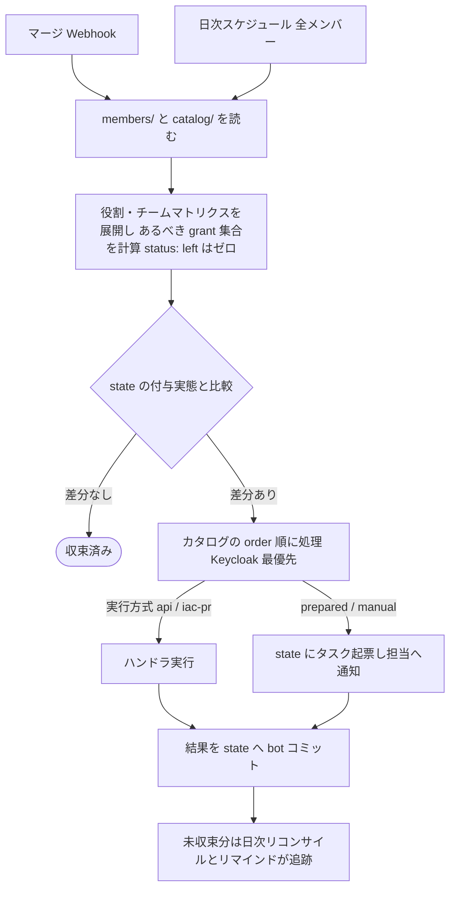
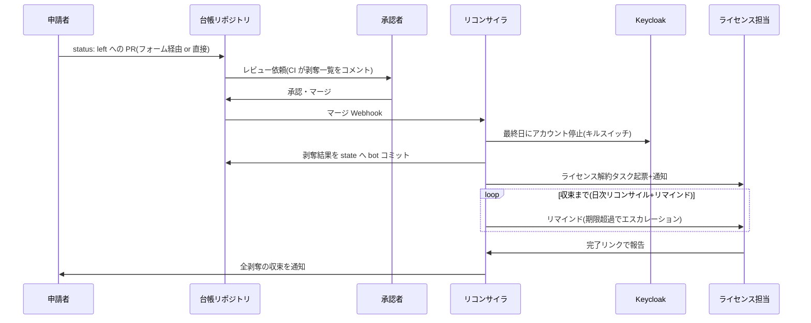

# 01. メンバーライフサイクル — 追加・役割変更・削除

**方式: Git 台帳+宣言的リコンサイル。**
追加・役割変更・削除は独立した3本のフローではなく、
「台帳リポジトリに宣言された **あるべき状態(desired)** と、実サービスへの
付与実態を記録した **state** の差分を収束させる」1本のリコンサイルループの
3つの現れとして実装する。台帳リポジトリの構成・スキーマは
[03](03-service-catalog.md#台帳リポジトリgit) を参照。

## 申請の入口(2つ)

| 入口 | 対象 | 動き |
|---|---|---|
| n8n フォーム(追加・役割変更・削除の3種) | 非エンジニア・定型申請 | 入力から YAML を生成し、台帳リポジトリにブランチ+PR を自動作成 |
| 直接 PR | エンジニア・緊急/特殊対応 | `members/` を直接編集して PR |

以降の経路は完全に同一で、**リコンサイラは変更の出どころを問わない**。
フォームは PR を作るための補助 UI にすぎない。

## フォーム項目(PR 生成の入力)

| 申請 | 項目 |
|---|---|
| 追加 | 氏名 / メールアドレス / affiliation(従業員・協力会社+社名) / 役割 / 所属チーム(複数選択可) / 開始日 / sponsor・契約終了日(協力会社のみ) / サービス固有 ID(GitHub ユーザー名等) / 備考 |
| 役割変更・チーム異動 | 対象メールアドレス / 新しい役割・所属チーム / 変更理由(必須) / 適用日(effective_from) |
| 削除 | 対象メールアドレス / 最終日(left_at) / 理由 / 即時遮断フラグ(immediate) |

サービス固有 ID は `members/<id>.yaml` の `accounts:` に宣言として保持し、
役割変更・削除ではフォーム入力ではなくファイルから引く
(毎回の手入力をなくし、別人への誤操作を防ぐ)。

## 承認 = PR レビュー

- **差分プレビュー**: CI(bot)が PR に「この変更で 付与: … / 剥奪: …」を
  コメントする(役割・チームマトリクスを展開)。承認者は YAML の1行差分ではなく
  権限への影響をレビューする。
- **入力検証も CI**: スキーマ・役割名とチーム名の存在・affiliation 制約
  (例: `admin` は従業員のみ)・重複、`extra_grants` の `review_until` 必須
  (個人例外には警告ラベル)を CI チェックで強制する。
  フォーム側でも事前検証するが、正は CI(直接 PR にも効く)。
- **申請者≠承認者**: ブランチ保護(レビュー必須・自己承認禁止)で強制。
- **協力会社メンバーに関する PR**: sponsor(受入責任者)のレビューを必須にする。
- **剥奪・削除・`admin` 付与を含む PR**: CI が警告ラベルを付け、承認2名を要求する
  (承認数の検査もチェックとして実装)。
- **放置 PR**: remind-scheduler が催促し、期限超過でクローズ+申請者へ通知。
- マージ=承認+実行指示。この一連は
  [request-approval の PR 実装](04-notification-abstraction.md#request-approval承認依頼)にあたる。

## リコンサイラ(reconcile)

起動は2系統: **マージ Webhook**(即時)と**日次スケジュール**(全メンバー再走査。
Webhook の取りこぼし対策、失敗の再試行、日付起点の予約発効を担う)。

- **適用順**: 原則「付与してから剥奪」(移行中のアクセス断絶を防ぐ)。
  `immediate` 指定時のみ剥奪を最優先する。
- **日付起点の発効**: `effective_from` / `left_at` が未来なら差分を「予約」として
  扱い、日次リコンサイルが日付到来時に実行する。PR は先にマージしてよい。
- **失敗時**: ハンドラ失敗は state に `failed` として記録して次のサービスへ進む。
  **desired ≠ state が残る限り日次リコンサイルが自動で再試行する**(自己修復)。
  試行回数を state に記録し、上限超過で `escalated` として管理者へ通知する。
- **冪等性**: ハンドラは「既に目標状態なら成功扱い」で作る(再試行の前提)。

## 各操作の現れ方

### 追加 — `members/<id>.yaml` を新規作成する PR

差分は「全付与」になる。order 最優先の Keycloak でユーザー作成 →
初期化メール送信(execute-actions-email でパスワード設定を要求)→
役割・チームに応じたグループへ追加。以降、SSO 対応 SaaS は初回ログイン時の
JIT プロビジョニングで連鎖する。GitHub 招待(招待に Team を含める。
→ [06](06-github-teams.md))などの自動操作、ライセンス購入・
Claude 招待などの手動タスク、枠(空き枠がなければ調達タスクを先行起票)は
カタログの3軸([03](03-service-catalog.md#分類の3軸))に従う。
収束するまでは desired ≠ state がそのまま「プロビジョニング中」を表す
(明示の状態機械は持たない)。

### 役割変更・チーム異動 — `role:` / `teams:` を書き換える PR

新旧のマトリクス差分だけが適用される(付与と剥奪の両方向)。
チーム異動(`teams: [alpha]` → `[beta]`)も専用フローではなく同じ機構で、
旧チームの Team・グループ剥奪と新チームの付与が差分として実行される。
兼務は `teams:` に複数書くだけ。剥奪を含む場合は差分プレビューの警告と
二重承認が効く。

### 削除 — `status: left`(+ `left_at`)にする PR

あるべき grant がゼロになり、差分=全剥奪。削除専用ロジックは持たない。

- **Keycloak アカウント停止(enabled: false)がキルスイッチ**:
  SSO 経由のアクセスが一括で止まる。削除ではなく停止にする
  (監査証跡と ID の保持、誤操作からの復帰)。通常は `left_at` に実行し、
  `immediate: true` ならマージ直後に停止してから残りを進める。
- state に付与記録があるサービスを全剥奪し、verify が `human` / `none` の
  サービスには記録漏れに備えた棚卸し確認タスクを起票する(期限=最終日)。
- ファイルは削除せず `left` のまま残す(現状の参照性。履歴は git が持つ)。

### 削除の起点は PR 申請だけではない

- **協力会社メンバー**: remind-scheduler が `contract_until` を監視し、
  期限 N 日前に sponsor へ更新確認タスクを起票する。更新されなければ
  **bot が `status: left` の PR を自動作成**し、sponsor のマージで発効する
  (継続するなら `contract_until` を更新する PR を出す)。
  自動起点でも必ず PR を通すため、承認と履歴が欠けない。
- **従業員**: 退職は全社 IdP・HR 側で先に起こり、プロジェクト IdP には自動伝播
  しない。退職手続きにプロジェクト側の削除申請を組み込む運用ルールに加え、
  可能なら全社 IdP のディレクトリ参照(または情シスからの退職者リスト)と
  `members/` を突合し、検知時に bot が削除 PR を自動作成する。

### ロールバック = git revert

誤った変更は revert の PR をマージすれば、リコンサイラが逆方向に収束させる
(再付与)。ただし手動で解約済みのライセンス等は自動では戻らず、
「再購入タスク」として起票される。

## シーケンス図(削除の例)

## バックストップ監査

- **weekly-audit(週次)**: 全メンバーの desired ≠ state 差分一覧を出す。
  宣言的モデルでは**この差分がそのまま「やり残し」の定義**になる。
  期限超過・`failed`・`escalated`、収束しないまま滞留しているメンバーを
  集計して管理者へレポートする。
- **consistency-audit(週次)**: state と実サービスを突合する。
  - verify が `api` / `event` のサービス(Keycloak・GitHub 等)は自動突合。
    **フローを通さず管理画面で直接行われた追加・削除もここで浮上する。**
  - verify が `human` / `none` のサービスは四半期ごとの棚卸しタスクを自動起票
    (全アカウント一覧と台帳の手動突合を依頼)。
  - 全社 IdP の退職者リストとの突合(入手可能な場合)。
  - 枠管理対象の総枠・使用数・state の整合(シート数の食い違い)。
