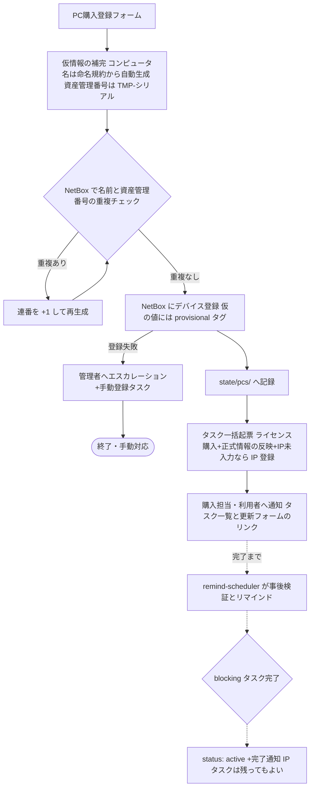

# 02. 開発PC購入フロー

開発PCの新規購入時に必要なタスクを申請起点で促し、漏れをなくす。

1. **コンピュータ名・資産管理番号の記録** — 正式には情シス部門が採番するため、
   **申請時点では未定のことがある**。仮の値で先へ進め、正式な値への更新を
   後から確実に回収する。
2. **NetBox への登録**(API で自動実行)
3. **必須ソフトのライセンス購入**(タスク起票+完了までリマインド)
4. **IPアドレスの記録** — 入力は強制しないが、未入力はリマインドで回収する。

## フロー(pc-purchase)



入口フローの責務はタスク起票と通知まで。完了の追跡・リマインドは
remind-scheduler([04](04-notification-abstraction.md))が担う。
PC 台帳の実体は台帳リポジトリの `state/pcs/<serial>.yaml`
(bot が記録。→ [03](03-service-catalog.md#台帳リポジトリgit))。
メンバー系と違い、PC 購入は宣言型ではなくイベント駆動の記録簿型のままとする。

## フォーム項目(PC購入登録)

| 項目 | 必須 | 備考 |
|---|---|---|
| 利用者名 / 利用者メール | ✔ | 台帳の `members/` と突合(未登録ならワーニング) |
| 機種・モデル | ✔ | 例: MacBook Pro 14 M4 |
| シリアル番号 | ✔ | **PC の不変キー**。`state/pcs/<serial>.yaml` のファイル名と NetBox の serial に使う |
| 購入日 | ✔ | ライセンスタスク等の期限起算日 |
| 用途 | ✔ | ドロップダウン: 開発 / 検証 / その他 |
| 資産管理番号 | − | 採番済みなら正式値、未定なら仮の値を入力。空欄なら `TMP-{シリアル}` を自動採番して仮扱い |
| 資産管理番号は仮の値 | − | チェックボックス。仮なら正式化タスクを起票 |
| コンピュータ名 | − | 同上。空欄なら命名規約から仮名を自動生成して仮扱い |
| コンピュータ名は仮の値 | − | チェックボックス |
| IPアドレス | − | 任意。未入力なら IP 登録タスクを起票 |

## 仮情報と正式化

- 正式なコンピュータ名・資産管理番号は情シス部門が採番するため未定でもよい。
  **未定でもフローは止めない**: 仮の値(入力または自動生成)で NetBox 登録まで
  進め、**「正式情報の反映」タスク(kind: `pc-official-info`)**を起票する。
- 仮の値を持つデバイスには NetBox で**タグ `provisional`** を付け、
  state 側にも項目ごとの `provisional` フラグを持つ(一覧性と監査のため)。
- **正式化の経路は2つ**あり、どちらを使ってもよい:
  1. **PC情報更新フォーム(pc-update)** — シリアルで対象を指定し、
     正式な資産管理番号・コンピュータ名・IPアドレスを任意の組み合わせで
     部分更新する。n8n が NetBox を更新(name / asset_tag の書き換え、
     provisional タグ除去)し、state へ bot コミットする。
  2. **NetBox を直接更新** — remind-scheduler の事後検証(verify: `api`)が
     「provisional タグが外れて正式値が入った」ことを検知し、タスクを
     自動クローズする。**更新の経路を強制しない**のがポイント。
- コンピュータ名は仮→正式で変わるため、**PC の同定キーはシリアル番号**とする
  (state のファイル名は `<serial>.yaml`、NetBox 側の追跡は device ID)。
  名前は変わってよいデータとして扱う。

## IPアドレス

- 申請時の入力は**任意**(キッティング前で未定のことが多い)。
- 未入力の場合は **IP 登録タスク(kind: `pc-ip`、`blocking: false`)**を起票する。
  - リマインドは通常どおり続けるが、**エスカレーションはせず、
    PC の `active` 判定も妨げない**(「入力は強制しない」の表現)。
  - 未登録のままの PC は weekly-audit の「IP 未登録一覧」に載り続ける。
- 記録先は NetBox の IPAM(IP アドレスを作成してデバイスに割当)。
  verify は「デバイスに IP が割当済みか」で判定するため、更新フォーム経由でも
  NetBox 直接編集でも自動クローズされる。

## 命名規約(仮コンピュータ名の生成規則)

```
{組織}-{用途}-{利用者ID}-{連番2桁}
例: khi-dev-hogeo-01
```

- これは**仮名の生成規則**。正式なコンピュータ名は情シス部門の採番規則に従う
  (この規約と異なってよい)。
- 利用者ID はメールアドレスのローカル部(`+` 以降と記号は除去)。
- 使用可能文字は小文字英数とハイフン、全体で 63 文字以内(ホスト名制約)。
- 用途は `dev` / `test` / `misc` にマップ。
- **この規約の正はこのドキュメント**とし、生成ロジックはワークフロー内の
  Code ノード1箇所に集約する(規約変更時の修正箇所を1つにする)。
- 名前の重複チェックは仮名・正式名の双方で行う(正式化時も含む)。

## NetBox 連携

**NetBox を実機情報(コンピュータ名・資産管理番号・IP アドレス)の
Source of Truth とする。** state には NetBox の device ID を持たせ、
詳細は NetBox 側を参照する。

| 操作 | API | 備考 |
|---|---|---|
| 重複チェック | `GET /api/dcim/devices/?name=` `?asset_tag=` | 件数 > 0 なら連番を進めて再試行(上限 99) |
| デバイス登録 | `POST /api/dcim/devices/` | name / **asset_tag(資産管理番号)** / serial / device_type / role / site / tags(`provisional`) / comments(利用者・購入日・申請元) |
| 正式化・更新 | `PATCH /api/dcim/devices/{id}` | name・asset_tag の書き換え、`provisional` タグ除去 |
| IP 登録 | `POST /api/ipam/ip-addresses/` | IP を作成してデバイスに割当(簡易にはデバイス紐付けのみでも可) |

- 資産管理番号は NetBox 標準の `asset_tag` フィールドに載せる
  (一意制約が使え、検索・突合が楽)。
- 認証は API Token(ヘッダ `Authorization: Token ...`)。
- `device_type` / `role` / `site` / タグ `provisional` は NetBox 側のマスタ登録が
  前提([05. 実行環境設計](05-environment.md) の初期セットアップに含める)。
  未知の機種は既定の device_type(例: `generic-laptop`)で登録し、
  正確な型番への更新タスクを起票する(登録自体を止めない)。
- 登録失敗(NetBox ダウン等)はフローを止めず、管理者へのエスカレーション
  通知と「手動登録タスク」の起票に切り替える。**登録漏れを検出できる状態**を
  常に維持するのが目的。

## 必須ソフトカタログ

必須ソフトも[サービスカタログ](03-service-catalog.md)と同じ考え方で
**データとして管理**し、増減はカタログの行の追加・無効化のみで対応する。
実体は台帳リポジトリの `catalog/pc-software.yaml` で、変更は PR で行う
(レビューと履歴が付く)。
各行は[分類の3軸](03-service-catalog.md#分類の3軸)の値も持てる。多くは
実行 `manual` × 確認 `human` だが、ライセンスサーバー等の API で割当を確認できる
ソフトは `verify: api` にしてタスクを自動クローズでき、フローティングライセンスの
枠は capacity ブロックで管理できる。

| 列 | 例 |
|---|---|
| ソフト名 | JetBrains All Products Pack |
| ライセンス種別 | 年間サブスクリプション(1シート) |
| 購入先・手順 | 購入ポータルの URL、社内手順へのリンク |
| 担当 | ライセンス購入担当(プレースホルダ) |
| 期限日数 | 購入日 + 7日 など |
| enabled | true / false |

タスク起票時は、カタログの有効行ごとに
「{コンピュータ名} / {利用者} 向けに {ソフト名} を購入する」というタスクを
`state/pcs/<serial>.yaml` のタスク(kind: `pc-license`)として作成する。

## リマインドと完了

- リマインドは [04 の共通パターン](04-notification-abstraction.md#リマインドループ共通型)に従う。
  期限の目安: ライセンス購入=購入日+カタログの期限日数、
  正式情報の反映=購入日+14日(情シスの採番リードタイムを考慮して緩め)、
  IP 登録=期限なし(リマインド間隔のみ)。
- verify が `human` のタスクは完了リンクで、`api` のタスク
  (正式情報・IP)は NetBox の事後検証で自動クローズされる。
- **`active` の条件は blocking タスク(ライセンス・正式情報)の完了**。
  IP タスク(`blocking: false`)は残っていてもよい。
- weekly-audit が滞留 PC(`license-pending` のまま)・期限超過タスク・
  `provisional` のままのデバイス・IP 未登録の一覧をレポートする(二重の漏れ防止)。

## 将来の拡張(設計上の考慮のみ)

- キッティング項目(OS設定、MDM登録、セキュリティソフト導入)を
  必須ソフトカタログと同列の「セットアップタスクカタログ」として追加可能。
- PC の退役(メンバー削除フローとの連動: 返却確認 → NetBox status 変更)は
  member-remove の manual タスクとして追加できる。
