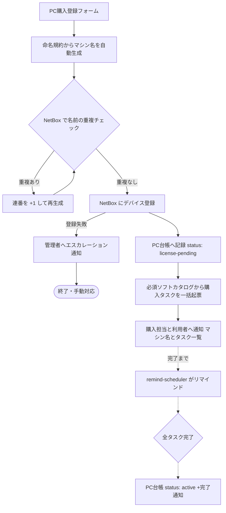

# 02. 開発PC購入フロー

開発PCの新規購入時に必要な3つのタスクを申請起点で促し、漏れをなくす。

1. **マシン名を決める**(命名規約に基づく自動生成)
2. **NetBox に登録する**(API で自動実行)
3. **必須ソフトのライセンス購入**(タスク起票+完了までリマインド)

## フロー(pc-purchase)



入口フローの責務はタスク起票と通知まで。購入完了の追跡・リマインドは
remind-scheduler([04](04-notification-abstraction.md))が担う。

## フォーム項目

| 項目 | 必須 | 備考 |
|---|---|---|
| 利用者名 / 利用者メール | ✔ | メンバー台帳と突合(未登録ならワーニング) |
| 機種・モデル | ✔ | 例: MacBook Pro 14 M4 |
| シリアル番号 | ✔ | NetBox の serial に記録 |
| 購入日 | ✔ | ライセンスタスクの期限起算日 |
| 用途 | ✔ | ドロップダウン: 開発 / 検証 / その他 |

## 命名規約

```
{組織}-{用途}-{利用者ID}-{連番2桁}
例: khi-dev-hogeo-01
```

- 利用者ID はメールアドレスのローカル部(`+` 以降と記号は除去)。
- 使用可能文字は小文字英数とハイフン、全体で 63 文字以内(ホスト名制約)。
- 用途は `dev` / `test` / `misc` にマップ。
- **この規約の正はこのドキュメント**とし、生成ロジックはワークフロー内の
  Code ノード1箇所に集約する(規約変更時の修正箇所を1つにする)。
- 規約外の名前を使いたい特殊ケースは、フォームの「マシン名を手動指定」
  オプション(通常は空欄)で受け、重複チェックのみ通して登録する。

## NetBox 連携

**NetBox をマシン名と実機情報の Source of Truth とする。**
PC台帳には NetBox の device ID を持たせ、詳細は NetBox 側を参照する。

| 操作 | API | 備考 |
|---|---|---|
| 重複チェック | `GET /api/dcim/devices/?name={名前}` | 件数 > 0 なら連番を進めて再試行(上限 99) |
| デバイス登録 | `POST /api/dcim/devices/` | name / serial / device_type / role / site / comments(利用者・購入日・申請元を記載) |

- 認証は API Token(ヘッダ `Authorization: Token ...`)。
- `device_type` / `role` / `site` は NetBox 側のマスタ登録が前提
  ([05. 実行環境設計](05-environment.md) の初期セットアップに含める)。
  未知の機種は既定の device_type(例: `generic-laptop`)で登録し、
  正確な型番への更新タスクを起票する(登録自体を止めない)。
- 登録失敗(NetBox ダウン等)はフローを止めず、管理者へのエスカレーション
  通知と「手動登録タスク」の起票に切り替える。**登録漏れを検出できる状態**を
  常に維持するのが目的。

## 必須ソフトカタログ

必須ソフトも[サービスカタログ](03-service-catalog.md)と同じ考え方で
**データとして管理**し、増減はカタログの行の追加・無効化のみで対応する。
各行は[分類の3軸](03-service-catalog.md#分類の3軸)の値も持てる。多くは
実行 `manual` × 確認 `human` だが、ライセンスサーバー等の API で割当を確認できる
ソフトは `verify: api` にしてタスクを自動クローズでき、フローティングライセンスの
枠は capacity ブロックで管理できる。

| 列 | 例 |
|---|---|
| ソフト名 | JetBrains All Products Pack |
| ライセンス種別 | 年間サブスクリプション(1シート) |
| 購入先・手順 | 購入ポータルの URL、社内手順へのリンク |
| 担当 | ライセンス購入担当(プレースホルダ) |
| 期限日数 | 購入日 + 7日 など |
| enabled | true / false |

タスク起票時は、カタログの有効行ごとに
「{マシン名} / {利用者} 向けに {ソフト名} を購入する」というタスクを
タスク台帳(kind: `pc-license`)へ作成する。

## リマインドと完了

- リマインドは [04 の共通パターン](04-notification-abstraction.md#リマインドループ共通型)に従う。
  期限は「購入日 + カタログの期限日数」。
- 担当者は通知内の完了リンク(タスクごと)で完了を報告する。
- 全タスク完了で PC台帳を `active` にし、利用者・申請者へ完了を通知する。
- weekly-audit が `license-pending` のまま滞留している PC と期限超過タスクを
  レポートする(二重の漏れ防止)。

## 将来の拡張(設計上の考慮のみ)

- キッティング項目(OS設定、MDM登録、セキュリティソフト導入)を
  必須ソフトカタログと同列の「セットアップタスクカタログ」として追加可能。
- PC の退役(メンバー削除フローとの連動: 返却確認 → NetBox status 変更)は
  member-remove の manual タスクとして追加できる。
