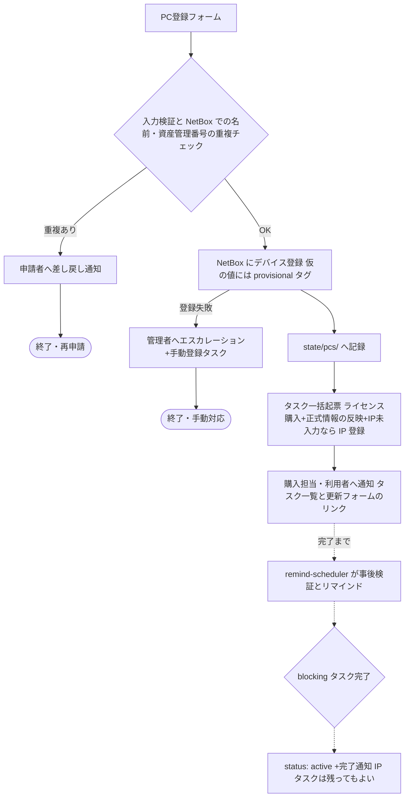

# 02. 開発PC登録フロー

開発PCの利用開始時に必要なタスクを登録起点で促し、漏れをなくす。
**新規購入だけでなく、他部署からの余剰PCの搬入も同じフローで扱う**
(フォームの登録区分で区別する)。

1. **コンピュータ名・資産管理番号の記録** — 正式には情シス部門が採番するため、
   登録時点では未定のことがある。どちらも**手入力**とし(自動生成はしない)、
   未定の場合は仮の値を入力して「仮」フラグ(provisional)を立て、
   正式な値への更新を後から確実に回収する。
2. **NetBox への登録**(API で自動実行)
3. **必須ソフトのライセンス購入**(タスク起票+完了までリマインド)
4. **IPアドレスの記録** — 入力は強制しないが、未入力はリマインドで回収する。

## フロー(pc-register)

入口フローの責務はタスク起票と通知まで。完了の追跡・リマインドは
remind-scheduler([04](04-notification-abstraction.md))が担う。
PC 台帳の実体は台帳リポジトリの `state/pcs/<資産管理番号>.yaml`
(bot が記録。→ [03](03-service-catalog.md#台帳リポジトリgit))。
メンバー系と違い、PC 登録は宣言型ではなくイベント駆動の記録簿型のままとする。

## フォーム項目(PC登録)

| 項目 | 必須 | 備考 |
|---|---|---|
| 登録区分 | ✔ | ドロップダウン: 新規購入 / 他部署からの搬入 |
| 利用者名 / 利用者メール | ✔ | 台帳の `members/` と突合(未登録ならワーニング) |
| 機種・モデル | ✔ | 例: MacBook Pro 14 M4 |
| 取得日(購入日・搬入日) | ✔ | タスクの期限起算日 |
| 用途 | ✔ | ドロップダウン: 開発 / 検証 / その他 |
| 資産管理番号 | ✔ | **手入力・PC の同定キー**(`state/pcs/<資産管理番号>.yaml` のファイル名)。情シス採番済みなら正式値、未定なら仮の値を入力 |
| 資産管理番号は仮の値 | − | チェックボックス。仮なら正式化タスクを起票 |
| コンピュータ名 | ✔ | **手入力**。同上 |
| コンピュータ名は仮の値 | − | チェックボックス |
| IPアドレス | − | 任意。未入力なら IP 登録タスクを起票 |
| 導入済みの必須ソフト | − | 搬入時など、既に導入済みのソフトをチェックすると該当の購入タスクを起票しない |

## 仮情報と正式化

- 正式なコンピュータ名・資産管理番号は情シス部門が採番するため未定でもよい。
  **未定でもフローは止めない**: 申請者が仮の値を手入力し「仮の値」チェックを
  付ければ、そのまま NetBox 登録まで進め、**「正式情報の反映」タスク
  (kind: `pc-official-info`)**を起票する。自動採番・自動生成は行わない
  (仮の値も人が決めて入力する)。
- 仮の値を持つデバイスには NetBox で**タグ `provisional`** を付け、
  state 側にも項目ごとの `provisional` フラグを持つ(一覧性と監査のため)。
- **正式化の経路は2つ**あり、どちらを使ってもよい:
  1. **機器情報更新フォーム(device-update。PC・サーバ共通 → [07](07-servers.md))** —
     資産管理番号(現在の値。仮でも可)で対象を指定し、
     正式な資産管理番号・コンピュータ名・IPアドレスを任意の組み合わせで
     部分更新する。n8n が NetBox を更新(name / asset_tag の書き換え、
     provisional タグ除去)し、state へ bot コミットする。
  2. **NetBox を直接更新** — remind-scheduler の事後検証(verify: `api`)が
     「provisional タグが外れて正式値が入った」ことを検知し、タスクを
     自動クローズする。**更新の経路を強制しない**のがポイント。
- **PC の同定キーは資産管理番号**とし、state のファイル名を
  `<資産管理番号>.yaml` とする(仮の番号のこともある)。正式化で番号が
  変わったときは **bot がファイルをリネーム(git mv)して記録を引き継ぐ**。
  ファイル名が変わっても NetBox 側の追跡は device ID が、履歴は git が
  連続性を保つ。仮番号どうしの衝突は登録時の重複チェック(NetBox の
  asset_tag)で防ぐ。

## IPアドレス

- 登録時の入力は**任意**(キッティング前で未定のことが多い)。
- 未入力の場合は **IP 登録タスク(kind: `pc-ip`、`blocking: false`)**を起票する。
  - リマインドは通常どおり続けるが、**エスカレーションはせず、
    PC の `active` 判定も妨げない**(「入力は強制しない」の表現)。
  - 未登録のままの PC は weekly-audit の「IP 未登録一覧」に載り続ける。
- 記録先は NetBox の IPAM(IP アドレスを作成してデバイスに割当)。
  verify は「デバイスに IP が割当済みか」で判定するため、更新フォーム経由でも
  NetBox 直接編集でも自動クローズされる。

## NetBox 連携

**NetBox を実機情報(コンピュータ名・資産管理番号・IP アドレス)の
Source of Truth とする。** state には NetBox の device ID を持たせ、
詳細は NetBox 側を参照する。

| 操作 | API | 備考 |
|---|---|---|
| 重複チェック | `GET /api/dcim/devices/?name=` `?asset_tag=` | 件数 > 0 なら申請者へ差し戻し(自動リネームはしない) |
| デバイス登録 | `POST /api/dcim/devices/` | name / **asset_tag(資産管理番号)** / device_type / role / site / tags(`provisional`) / comments(利用者・取得日・登録区分・申請元) |
| 正式化・更新 | `PATCH /api/dcim/devices/{id}` | name・asset_tag の書き換え、`provisional` タグ除去 |
| IP 登録 | `POST /api/ipam/ip-addresses/` | IP を作成してデバイスに割当(簡易にはデバイス紐付けのみでも可) |

- 資産管理番号は NetBox 標準の `asset_tag` フィールドに載せる
  (一意制約が使え、検索・突合が楽)。
- 認証は API Token(ヘッダ `Authorization: Token ...`)。
- `device_type` / `role` / `site` / タグ `provisional` は NetBox 側のマスタ登録が
  前提([05. 実行環境設計](05-environment.md) の初期セットアップに含める)。
  未知の機種は既定の device_type(例: `generic-laptop`)で登録し、
  正確な型番への更新タスクを起票する(登録自体を止めない)。
- 登録失敗(NetBox ダウン等)はフローを止めず、管理者へのエスカレーション
  通知と「手動登録タスク」の起票に切り替える。**登録漏れを検出できる状態**を
  常に維持するのが目的。

## 必須ソフトカタログ

必須ソフトも[サービスカタログ](03-service-catalog.md)と同じ考え方で
**データとして管理**し、増減はカタログの行の追加・無効化のみで対応する。
実体は台帳リポジトリの `catalog/pc-software.yaml` で、変更は PR で行う
(レビューと履歴が付く)。
各行は[分類の3軸](03-service-catalog.md#分類の3軸)の値も持てる。多くは
実行 `manual` × 確認 `human` だが、ライセンスサーバー等の API で割当を確認できる
ソフトは `verify: api` にしてタスクを自動クローズでき、フローティングライセンスの
枠は capacity ブロックで管理できる。

| 列 | 例 |
|---|---|
| ソフト名 | JetBrains All Products Pack |
| ライセンス種別 | 年間サブスクリプション(1シート) |
| 購入先・手順 | 購入ポータルの URL、社内手順へのリンク |
| 担当 | ライセンス購入担当(プレースホルダ) |
| 期限日数 | 取得日 + 7日 など |
| enabled | true / false |

タスク起票時は、カタログの有効行ごとに
「{コンピュータ名} / {利用者} 向けに {ソフト名} を購入する」というタスクを
`state/pcs/<資産管理番号>.yaml` のタスク(kind: `pc-license`)として作成する。
フォームで「導入済み」にチェックされたソフト(搬入PCなど)は起票しない。

## リマインドと完了

- リマインドは [04 の共通パターン](04-notification-abstraction.md#リマインドループ共通型)に従う。
  期限の目安: ライセンス購入=取得日+カタログの期限日数、
  正式情報の反映=取得日+14日(情シスの採番リードタイムを考慮して緩め)、
  IP 登録=期限なし(リマインド間隔のみ)。
- verify が `human` のタスクは完了リンクで、`api` のタスク
  (正式情報・IP)は NetBox の事後検証で自動クローズされる。
- **`active` の条件は blocking タスク(ライセンス・正式情報)の完了**。
  IP タスク(`blocking: false`)は残っていてもよい。
- weekly-audit が滞留 PC(`license-pending` のまま)・期限超過タスク・
  `provisional` のままのデバイス・IP 未登録の一覧をレポートする(二重の漏れ防止)。

## 将来の拡張(設計上の考慮のみ)

- キッティング項目(OS設定、MDM登録、セキュリティソフト導入)を
  必須ソフトカタログと同列の「セットアップタスクカタログ」として追加可能。
- PC の退役・返却(メンバー削除フローとの連動: 返却確認 → NetBox status 変更)や
  他部署への譲渡は、member-remove の manual タスクや device-update の拡張として
  追加できる。
