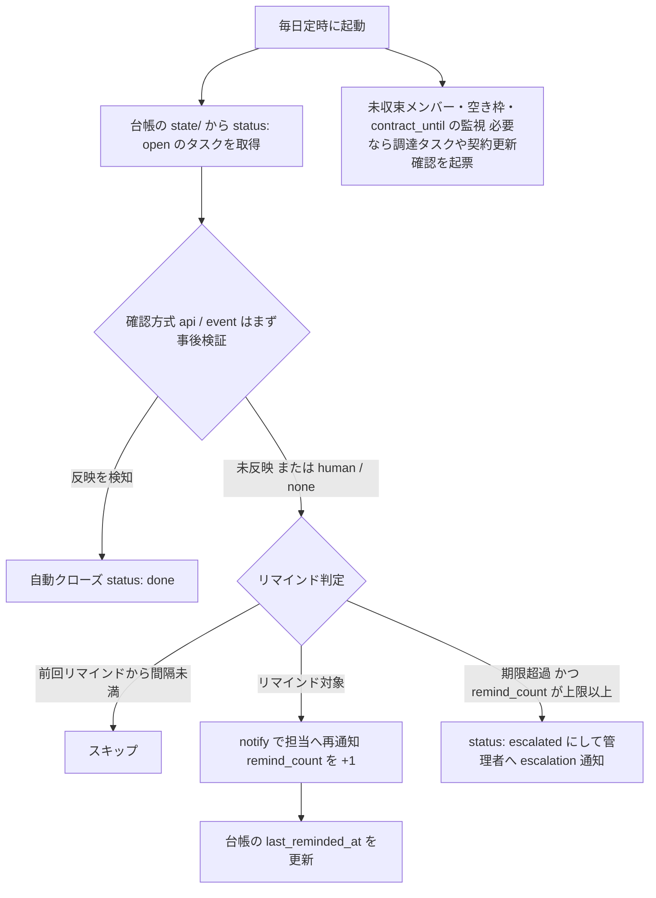

# 04. 通知・承認の抽象化 — チャネル後決めの設計

通知・承認チャネル(Gmail / Slack / その他)は未決定。
どのチャネルに決まっても、また後から変更しても、各フローを改修せずに済む設計にする。

## 方針

チャネルに触れる処理を2つの**汎用サブワークフロー**に閉じ込める。
呼び出し側(入口フロー・スケジューラ)は入出力インターフェースだけに依存する。

### notify(通知)

```jsonc
// 入力
{
  "to": ["<宛先ID>"],          // メールアドレスを正規IDとし、チャネル実装側で必要ならSlack ID等へ変換
  "subject": "...",
  "body": "...",               // プレーンテキスト+URL。チャネル固有の装飾は実装側で付与
  "level": "info | warn | escalation"
}
// 出力
{ "ok": true }
```

### request-approval(承認依頼)

```jsonc
// 入力
{
  "approvers": ["<宛先ID>"],
  "subject": "...",
  "body": "...",               // 承認対象の内容(特に剥奪・削除は影響を明記)
  "timeout_days": 3
}
// 出力
{ "approved": true, "responder": "...", "responded_at": "...", "timed_out": false }
```

実装は2つ用意し、入出力 IF は共通にする:

- **PR レビュー実装(メンバー系)**: 台帳リポジトリへの PR 作成 → マージ/クローズ
  待ち。approvers はレビュー必須者(ブランチ保護・sponsor)、timeout_days は
  放置 PR の催促・失効に対応する(→ [01](01-member-lifecycle.md))。
- **再開リンク実装(汎用)**: 下記のチャネル非依存方式。

## チャネル非依存の承認・完了報告方式

**Wait ノード(On webhook call)+ `$execution.resumeUrl`** を基本とする。

- 承認依頼: 本文に「承認リンク」「却下リンク」(resumeUrl +
  `?decision=approve` / `?decision=reject`)を埋め込んで notify で送る。
  どのチャネルで届いても、リンクを開けば実行が再開されるため**チャネル非依存**。
- タスク完了報告: タスク起票時に同様の「完了リンク」(`complete_url`)を発行して
  台帳(state 内のタスク)に保存し、通知・リマインドの本文に毎回含める。
  担当者はチャネルを問わずリンクを開くだけで完了報告できる。
  完了リンクが必須なのは確認方式が `human` / `none` のタスクのみで、
  `api` / `event` のタスクは事後検証で自動クローズされる
  (→ [03「軸2: 確認方式」](03-service-catalog.md#軸2-確認方式verify))。
- タイムアウト: Wait の Limit wait time を `timeout_days` に設定し、
  期限超過は `timed_out: true` で返す(呼び出し側が却下扱い・再申請案内を判断)。
- セキュリティ: resumeUrl は推測困難だが、**URL を知っていれば誰でも押せる**。
  当面は「n8n を社内ネットワーク限定で公開し、リンクは承認者・担当者本人にのみ
  送る」を前提とする。将来必要になれば、リンクに署名付きトークンを付与して
  再開後の Code ノードで検証する方式に強化できる(IFは不変)。
- 最適化オプション: チャネル確定後、Gmail / Slack ノードの
  「送信して応答を待つ(sendAndWait)」= ネイティブ承認ボタンに内部実装を
  差し替えてもよい。入出力IFは変えない。

## リマインドループ(共通型)

リマインドは **Wait で実行をぶら下げる方式ではなく、台帳走査型**を基本とする。
実行が長期間滞留せず、n8n の再起動・障害に強く、リマインド状況が台帳で見える。

**remind-scheduler(Schedule Trigger、毎日1回)**:



| パラメータ | 既定値 |
|---|---|
| リマインド間隔 | 3日 |
| リマインド上限(超過でエスカレーション) | 3回 |
| エスカレーション先 | 管理者(プレースホルダ) |

- タスクのクローズは確認方式で決まる: `human` / `none` は完了リンクのクリック、
  `api` / `event` は事後検証による**自動クローズ**(人の完了報告を待たない。
  リマインドは「依頼済みだが未反映」という事実に基づくため、済んだ作業への
  催促が起きない)。クローズ時は「同一申請の全タスク完了」を判定し、
  親レコード(メンバー / PC)の status を進めて完了通知を送る。
- `blocking: false` のタスク(例: PC の IP 登録)は親の完了判定に含めないが、
  リマインドと監査の対象には含める。エスカレーションはしない
  (→ [03](03-service-catalog.md#台帳リポジトリgit))。
- 枠(capacity)管理対象の空き枠チェックもこの日次実行に含め、
  閾値割れで調達タスクを起票する(→ [03「軸3: 枠」](03-service-catalog.md#軸3-枠capacity))。
- 協力会社メンバーの `contract_until` 監視もここで行い、期限 N 日前に
  sponsor へ更新確認タスクを起票、未更新なら削除 PR を自動作成する
  (→ [01](01-member-lifecycle.md))。
- タスクの実体は台帳リポジトリの `state/` 内
  ([03](03-service-catalog.md#台帳リポジトリgit))。走査・更新は
  ledger-read / ledger-write 経由なので、この節の設計は格納先に依存しない。
- **weekly-audit(週次)** は remind-scheduler とは別に、未完了・期限超過・
  `failed` ・`escalated` の全体像を集計して管理者へレポートする
  (個別リマインドが握りつぶされても週次で必ず浮上する)。

## チャネル差し替え手順

1. `notify` / `request-approval` の内部ノードだけを対象チャネルの実装に入れ替える
   (例: SMTP ノード → Gmail ノード、または Slack ノード)。
2. 宛先IDの変換(メール → Slack ユーザーID)が必要なら実装側に変換表を持つ。
3. 呼び出し側のワークフローは一切変更しない。
4. ローカル検証では SMTP を Mailpit([05](05-environment.md))に向けることで、
   チャネル未決のまま全フローの動作検証ができる。
