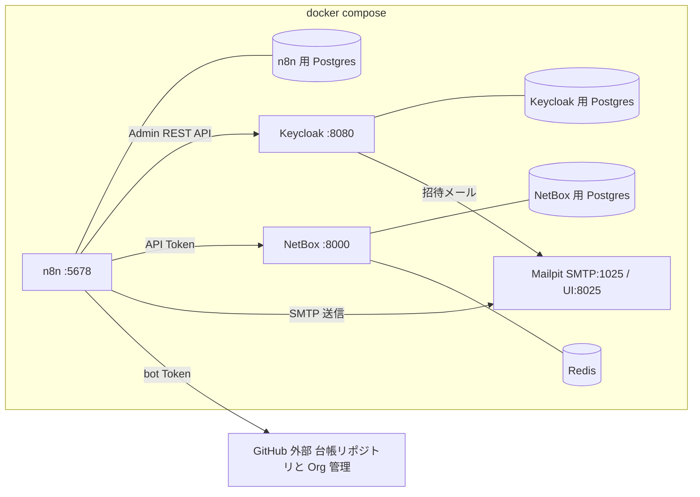

# 05. 実行環境設計 — docker compose(次ステップの土台)

実装フェーズで構築するローカル検証環境の設計。
チャネル未決・実サービス未接続でも全フローを検証できる構成にする。

## 構成

| サービス | イメージ | ポート | 用途 |
|---|---|---|---|
| n8n | `n8nio/n8n` | 5678 | ワークフロー実行。DB は Postgres(SQLite は検証でも避ける) |
| n8n-postgres | `postgres:16` | − | n8n の永続化 |
| keycloak | `quay.io/keycloak/keycloak` | 8080 | プロジェクト IdP。SMTP を Mailpit に向けて招待メールも検証 |
| keycloak-postgres | `postgres:16` | − | Keycloak の永続化 |
| netbox(+worker) | `netboxcommunity/netbox` | 8000 | 実機情報(コンピュータ名・資産管理番号・IP)の Source of Truth |
| netbox-postgres | `postgres:16` | − | NetBox の永続化 |
| netbox-redis | `redis` | − | NetBox のキュー・キャッシュ |
| mailpit | `axllent/mailpit` | 1025 / 8025 | 送信メールのキャッチャー。チャネル未決のまま notify を検証 |

- ボリュームで永続化(n8n data / 各 Postgres / NetBox media)。
- Webhook・resumeUrl を有効に使うため `WEBHOOK_URL`(n8n)をローカルの
  到達可能な URL に設定する。社内公開時はリバースプロキシ + TLS を前提とする。
- 台帳リポジトリ(github.com)からのマージ Webhook はローカルの n8n に
  届かないため、ローカル検証ではポーリング(Schedule + GitHub API)で代替するか
  smee.io 等のトンネルを使う。日次リコンサイルがあるため取りこぼしても収束する。

## 初期セットアップ手順(実装フェーズで実施)

1. `docker compose up -d` → n8n オーナーアカウント作成、NetBox superuser 作成、
   Keycloak 管理者作成。
2. Keycloak: realm 作成、役割マトリクスに対応するグループ作成、
   n8n 用サービスアカウントクライアント発行(realm-management の
   `manage-users` / `query-users` / `query-groups`)、SMTP を Mailpit に設定。
3. NetBox: API Token 発行、マスタ登録(site、device role: `dev-pc`、
   manufacturer、既定 device_type: `generic-laptop`、タグ `provisional`、
   IPAM の検証用プレフィックス)。
4. 台帳リポジトリ(`LEDGER_REPO`)整備: ディレクトリ構成([03](03-service-catalog.md#台帳リポジトリgit))と
   カタログ初期データの投入、ブランチ保護(レビュー必須・自己承認禁止)、
   bot マシンアカウントと Token、CI(スキーマ検証・affiliation 制約・
   権限差分プレビューコメント・`state/` の人手編集拒否)、マージ Webhook。
5. n8n: Credentials 登録(下記)、サブWF(notify / request-approval /
   ledger-read / ledger-write)を先に作成し、リコンサイラ・入口フローから参照する。

## 認証情報の方針

| Credential | 種別 | 権限・備考 |
|---|---|---|
| GitHub PAT(Org 管理用) | HTTP Header Auth / GitHub | `admin:org`(招待・削除・Team 操作)。マシンユーザー推奨 |
| GitHub Token(台帳 bot 用) | HTTP Header Auth / GitHub | 台帳リポジトリへの PR 作成と `state/` への直接コミット(ブランチ保護バイパス)。Org 管理用とは分ける |
| Keycloak サービスアカウント | OAuth2 Client Credentials | realm-management の `manage-users` / `query-users` / `query-groups`。コネクタと事後検証で使用 |
| NetBox Token | HTTP Header Auth | `Authorization: Token ...`。書き込み可 |
| SMTP | SMTP | 検証: Mailpit(認証なし)。本番: チャネル決定後に差し替え |
| n8n API Key | n8n API | consistency-audit で n8n 自身のユーザーを監査する場合のみ |

- すべて n8n の Credentials に保存し、ワークフロー JSON には含めない。
- `.env` はローカル検証専用とし、`.gitignore` に含める。`.env.example` をコミットする。

## プレースホルダ一覧(実装時に置き換える値)

| 名前 | 例 | 用途 |
|---|---|---|
| `GITHUB_ORG` | `koala-heavy-industries` | 招待・削除・突合の対象 Org |
| `LEDGER_REPO` | `koala-heavy-industries/khi-ledger` | 台帳リポジトリ |
| `KEYCLOAK_URL` / `KEYCLOAK_REALM` | `http://keycloak:8080` / `khi-dev` | プロジェクト IdP |
| `NETBOX_URL` | `http://netbox:8000` | NetBox API |
| `APPROVER_EMAILS` | `pm@example.com` | 承認者(申請者と分離) |
| `ADMIN_EMAILS` | `it-admin@example.com` | エスカレーション・監査レポート宛先 |
| `LICENSE_ASSIGNEE` | `buy@example.com` | ライセンス購入タスクの既定担当 |
| `REMIND_INTERVAL_DAYS` / `REMIND_MAX` | `3` / `3` | リマインド制御 |

## 実装フェーズのロードマップ

依存の少ない順に積み上げる。各段階で動作確認してから次へ進む。

1. **環境**: compose + `.env.example` 作成、n8n / Keycloak / NetBox / Mailpit
   起動確認、Keycloak の realm・グループ・サービスアカウント設定。
2. **台帳リポジトリ**: 構成・スキーマ・カタログ初期データ・ブランチ保護・
   bot アカウント・CI 検証(スキーマ / affiliation 制約 / 差分プレビュー)。
3. **土台サブWF**: `ledger-read` / `ledger-write`(GitHub API 実装)、
   `notify` / `request-approval`(Mailpit 宛て+PR 実装)。
4. **リコンサイラ + service-keycloak**: 中核。追加 → 役割変更 → 削除を
   Keycloak のみで一巡させる(ユーザー作成・グループ・停止・JIT 連鎖の確認)。
5. **remind-scheduler**: state 走査 → 事後検証・自動クローズ → リマインド →
   エスカレーション、`contract_until`・空き枠の監視。
6. **pc-register / pc-update**: NetBox 連携(重複チェック・登録・正式化)、
   `state/pcs/` への記録。
7. **コネクタ追加**: `service-github`(冪等性・error output の確認を含む)。
8. **監査**: weekly-audit(desired ≠ state 一覧)/ consistency-audit
   (Keycloak・GitHub との突合)。
9. **本番化**: チャネル決定後に notify の内部を差し替え、
   実カタログ・実マトリクス・実メンバーを投入。

各段階の完成条件は「Mailpit 上で通知・承認・リマインドの全メールが確認でき、
台帳リポジトリの state が設計([01](01-member-lifecycle.md) /
[02](02-pc-register.md) / [03](03-service-catalog.md))どおりに収束すること」。
