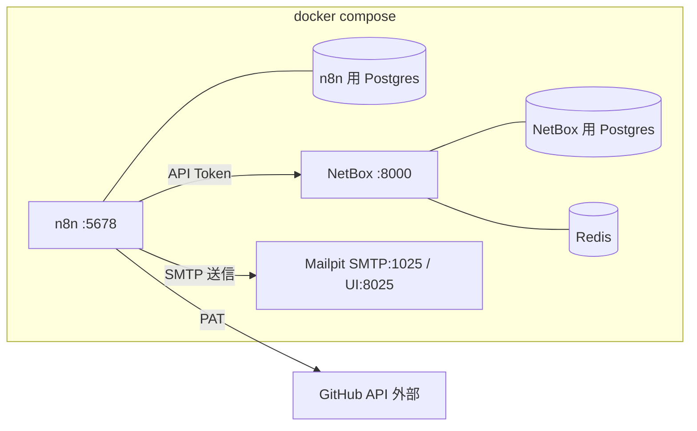

# 05. 実行環境設計 — docker compose(次ステップの土台)

実装フェーズで構築するローカル検証環境の設計。
チャネル未決・実サービス未接続でも全フローを検証できる構成にする。

## 構成

| サービス | イメージ | ポート | 用途 |
|---|---|---|---|
| n8n | `n8nio/n8n` | 5678 | ワークフロー実行。DB は Postgres(SQLite は検証でも避ける) |
| n8n-postgres | `postgres:16` | − | n8n の永続化 |
| netbox(+worker) | `netboxcommunity/netbox` | 8000 | マシン名・実機情報の Source of Truth |
| netbox-postgres | `postgres:16` | − | NetBox の永続化 |
| netbox-redis | `redis` | − | NetBox のキュー・キャッシュ |
| mailpit | `axllent/mailpit` | 1025 / 8025 | 送信メールのキャッチャー。チャネル未決のまま notify を検証 |

- ボリュームで永続化(n8n data / 両 Postgres / NetBox media)。
- Webhook・resumeUrl を有効に使うため `WEBHOOK_URL`(n8n)をローカルの
  到達可能な URL に設定する。社内公開時はリバースプロキシ + TLS を前提とする。

## 初期セットアップ手順(実装フェーズで実施)

1. `docker compose up -d` → n8n オーナーアカウント作成、NetBox superuser 作成。
2. NetBox: API Token 発行、マスタ登録(site、device role: `dev-pc`、
   manufacturer、既定 device_type: `generic-laptop`)。
3. n8n: Credentials 登録(下記)、Data Tables に台帳・カタログ4種を作成
   (メンバー台帳 / PC台帳 / タスク台帳 / サービスカタログ+役割マトリクス+必須ソフトカタログ)。
4. サブWF(notify / request-approval / ledger-read / ledger-write)を先に作成し、
   入口フローから参照する。

## 認証情報の方針

| Credential | 種別 | 権限・備考 |
|---|---|---|
| GitHub PAT | HTTP Header Auth / GitHub | `admin:org`(招待・削除・Team 操作)。マシンユーザー推奨 |
| NetBox Token | HTTP Header Auth | `Authorization: Token ...`。書き込み可 |
| SMTP | SMTP | 検証: Mailpit(認証なし)。本番: チャネル決定後に差し替え |
| n8n API Key | n8n API | consistency-audit で n8n 自身のユーザーを監査する場合のみ |

- すべて n8n の Credentials に保存し、ワークフロー JSON には含めない。
- `.env` はローカル検証専用とし、`.gitignore` に含める。`.env.example` をコミットする。

## プレースホルダ一覧(実装時に置き換える値)

| 名前 | 例 | 用途 |
|---|---|---|
| `GITHUB_ORG` | `koala-heavy-industries` | 招待・削除・突合の対象 Org |
| `NETBOX_URL` | `http://netbox:8000` | NetBox API |
| `NAMING_PREFIX` | `khi` | 命名規約の組織プレフィックス |
| `APPROVER_EMAILS` | `pm@example.com` | 承認者(申請者と分離) |
| `ADMIN_EMAILS` | `it-admin@example.com` | エスカレーション・監査レポート宛先 |
| `LICENSE_ASSIGNEE` | `buy@example.com` | ライセンス購入タスクの既定担当 |
| `REMIND_INTERVAL_DAYS` / `REMIND_MAX` | `3` / `3` | リマインド制御 |

## 実装フェーズのロードマップ

依存の少ない順に積み上げる。各段階で動作確認してから次へ進む。

1. **環境**: compose + `.env.example` 作成、n8n / NetBox / Mailpit 起動確認。
2. **土台**: Data Tables(台帳・カタログ)作成、`ledger-read` / `ledger-write`。
3. **チャネル抽象化**: `notify` / `request-approval`(Mailpit 宛て)、
   承認リンク・完了リンクの動作確認。
4. **remind-scheduler**: 台帳走査 → リマインド → エスカレーションの一連。
5. **pc-purchase**: 単独で完結し効果が見えやすいため入口フローの先頭に。
   NetBox 連携(重複チェック・登録)を含む。
6. **member-add** → **member-remove** → **member-change-role** の順
   (削除は追加の逆操作+棚卸し、変更は両者の差分適用なので最後)。
7. **コネクタ**: `service-github`(冪等性・error output の確認を含む)。
8. **監査**: weekly-audit / consistency-audit。
9. **本番化**: チャネル決定後に notify / request-approval の内部を差し替え、
   実カタログ・実マトリクスを投入。

各ワークフローの完成条件は「Mailpit 上で通知・承認・リマインドの全メールが
確認でき、台帳の status 遷移が設計([01](01-member-lifecycle.md) /
[02](02-pc-purchase.md) / [03](03-service-catalog.md))どおりであること」。
