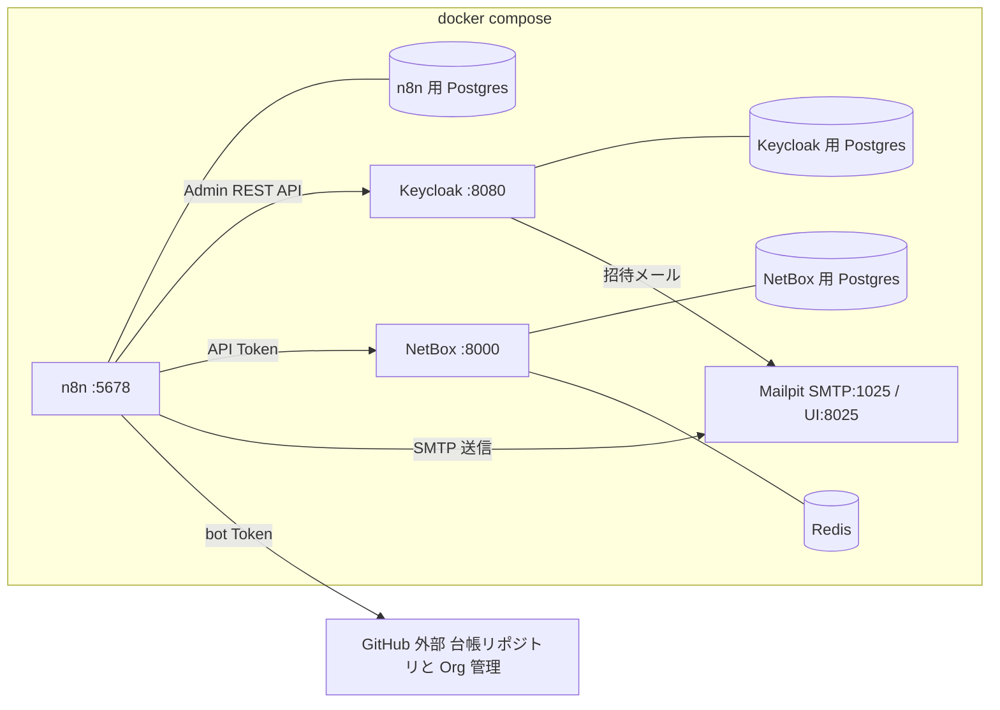

# 05. 実行環境設計 — docker compose(次ステップの土台)

実装フェーズで構築するローカル検証環境の設計。
チャネル未決・実サービス未接続でも全フローを検証できる構成にする。

## 構成



| サービス | イメージ | ポート | 用途 |
|---|---|---|---|
| n8n | `n8nio/n8n` | 5678 | ワークフロー実行。DB は Postgres(SQLite は検証でも避ける) |
| n8n-postgres | `postgres:16` | − | n8n の永続化 |
| keycloak | `quay.io/keycloak/keycloak` | 8080 | プロジェクト IdP。SMTP を Mailpit に向けて招待メールも検証 |
| keycloak-postgres | `postgres:16` | − | Keycloak の永続化 |
| netbox(+worker) | `netboxcommunity/netbox` | 8000 | 実機情報(コンピュータ名・資産管理番号・IP)の Source of Truth |
| netbox-postgres | `postgres:16` | − | NetBox の永続化 |
| netbox-redis | `redis` | − | NetBox のキュー・キャッシュ |
| mailpit | `axllent/mailpit` | 1025 / 8025 | 送信メールのキャッチャー。チャネル未決のまま notify を検証 |

- ボリュームで永続化(n8n data / 各 Postgres / NetBox media)。
- Webhook・resumeUrl を有効に使うため `WEBHOOK_URL`(n8n)をローカルの
  到達可能な URL に設定する。社内公開時はリバースプロキシ + TLS を前提とする。
- 台帳リポジトリ(github.com)からのマージ Webhook はローカルの n8n に
  届かないため、ローカル検証ではポーリング(Schedule + GitHub API)で代替するか
  smee.io 等のトンネルを使う。日次リコンサイルがあるため取りこぼしても収束する。

## 必要なリソース

**Docker に 4 GiB 以上のメモリを割り当てること。**

全サービスを同時に動かすと約 1.9 GiB を使う(NetBox 約 0.7 GiB、n8n 約 0.6 GiB、
Keycloak 約 0.4 GiB、Postgres 3台とその他で約 0.2 GiB)。割り当てが 2 GiB 程度だと
**n8n が繰り返し停止して検証にならない**(実際に起きた。ワークフローのインポートが
exit 137 で失敗し、Webhook も応答しなくなる)。

Docker Desktop の 設定 → Resources → Memory から増やす。
一時的にしのぐなら、使わないサービスを止める:

```bash
docker compose stop netbox netbox-postgres netbox-redis   # メンバー系だけ検証する場合
docker compose stop keycloak                              # PC・サーバ系だけ検証する場合
```

NetBox の背景ジョブ用ワーカーは既定で起動しない(`--profile netbox-jobs` で起動)。
デバイス・IP の CRUD には不要なため。

## 構築時に判明した制約(検証済み)

| 事項 | 内容 |
|---|---|
| **Code ノードで YAML を扱うには許可が要る** | 台帳が YAML のため必須。`NODE_FUNCTION_ALLOW_EXTERNAL: "yaml"` を n8n に設定すると Code ノードから `require('yaml')` が使える(`yaml` は n8n の依存として同梱。`js-yaml` は入っていない)。設定なしでは Code ノードが YAML を解釈できず、**この設計は成立しない** |
| **Postgres は 17 以上** | n8n 2.x は Postgres 16 を「互換サポートのみ」として警告する。17-alpine を使う |
| **CLI 実行はブローカーポートが衝突する** | 起動中のインスタンスがあると `n8n execute` が「Task Broker's port 5679 is already in use」で失敗する。`docker compose exec -e N8N_RUNNERS_BROKER_PORT=5699 -T n8n n8n execute --id <id>` のように別ポートを渡す |
| **ワークフローは CLI でインポートする** | `workflows/*.json` を Git 管理し、`docker compose exec -T n8n n8n import:workflow --separate --input=/workflows`。UI で作らないことで定義が Git に残り、[08 のワークフロー定義監査](08-safeguards.md#脅威モデルと残余リスク)とも接続できる。ディレクトリ指定(`--separate`)ならワークフロー JSON に top-level `id` は不要だが、単一ファイル指定では必須(無いと NOT NULL 制約で失敗する) |
| **設定値は `$env` でワークフローに渡す** | `N8N_BLOCK_ENV_ACCESS_IN_NODE: "false"` を設定し、`LEDGER_REPO` 等を compose から注入する。ワークフロー JSON に環境固有の値を埋め込まずに済む。n8n は既に全 credential を保持する信頼境界なので脅威モデルは変わらない |
| **Credential は秘密をファイルに残さず投入する** | `scripts/import-credentials.py` が `.env` から生成した JSON をコンテナへパイプし、`n8n import:credentials` で取り込む(n8n が `N8N_ENCRYPTION_KEY` で暗号化保存)。中間ファイルはリポジトリに残らない |
| **HTTP Request ノードは JSON 配列を自動で複数アイテムに分割する** | GitHub の contents API がディレクトリ一覧(配列)を返すと、後続ノードには「配列1件」ではなく「エントリごとのアイテム」が渡る。配列として扱うコードは空振りするので注意。あわせて、**ノード間をインデックスで対応付ける実装は避け**、応答自体が持つ `path` / `sha` から判別する(アイテム数が変わっても壊れない) |
| **サブワークフローは active でないと呼べない** | Execute Workflow から呼ぶ側・呼ばれる側ともに有効化が必要(`n8n update:workflow --id=<id> --active=true` のあと再起動)。`scripts/deploy-workflows.py` がインポート・有効化・再起動をまとめて行う |
| **CLI に `delete:workflow` は無い** | n8n 2.x では提供されない。検証で作った一時ワークフローの削除は DB から直接行う(`scripts/run-workflow.py` が実施) |
| **Wait を含むフローは CLI 実行では検証できない** | `n8n execute` は一発限りのプロセスなので、実行が待機に入ると再開できない。稼働中インスタンスで動かす必要があるため、Webhook トリガーの一時ワークフローから呼び出して検証する(承認リンクのクリックまで通しで確認できる) |
| **多段のサブワークフロー呼び出しは CLI 実行で不安定** | `n8n execute` から Execute Workflow を多段に辿るワークフロー(remind-scheduler → ledger-read/notify/ledger-write)は、ノードが1つも実行されないまま crashed になることがある。稼働中インスタンスで動かせば正常に動作するため、Webhook トリガーの一時ワークフローから呼び出して検証する |
| **スケジュールトリガーはサブワークフローに同居させない** | Schedule トリガーと Execute Workflow トリガーを同じワークフローに置くと CLI 実行が起動しない。定期実行は `cron-daily` に分離し、各処理は純粋なサブワークフローに保つ(テスト容易性のためにも有効) |
| **コンテナ間の NetBox は 8080** | ホストへは 8000 で公開するが、コンテナ内は 8080 で待ち受ける。`NETBOX_URL` をコンテナ間通信用に `http://netbox:8080` にしないと接続できない(ホスト公開ポートと混同しやすい) |
| **Webhook トリガーのフローは Execute Workflow の宛先を式にできない** | 宛先を `={{ $json.xxx }}` のような式にすると**ワークフローを有効化できず**、Webhook も登録されない(エラーは出ない。`active` が false のままになる)。汎用の実行ランナーは作れないため、入口フローごとに Webhook トリガーを持たせる。リコンサイラのように Execute Workflow トリガーのみのフローでは式による動的な宛先を使える |
| **Form Trigger はカスタムパスを持てない** | 公開 URL は `/form/<webhookId>` になる(`path` を指定しても使われない)。JSON に固定の `webhookId` を書いておけば URL は安定する |
| **Form の送信フィールド名は `field-0` からの連番** | 表示ラベルではなく定義順の連番で送られ、サーバ側が位置でラベルに解決する(ワークフローにはラベルをキーとして届く)。**ブラウザから使う分には問題ない**(ページを開いた時点の定義に沿って送るため)。注意が要るのは**連番を決め打ちして直接 POST する場合**で、項目を挿入・並び替えすると値が隣の項目に入る。しかも**エラーにならず誤った値で成功する**。検証用の curl コマンドや外部システムからの連携を書くときは、フォーム定義の変更に追随させること |
| **resume URL は署名付きで、既にクエリを含む** | `$execution.resumeUrl` は `?signature=<HMAC>` を含む。承認/却下のパラメータは `&` で連結する(→ [04](04-notification-abstraction.md#チャネル非依存の承認完了報告方式)) |
| **NetBox の API トークンは v2 形式** | イメージの `SUPERUSER_API_TOKEN` は効かず、トークン作成には `API_TOKEN_PEPPER_1` の設定が必須。トークン値はサーバが生成し、**作成時にしか平文を取得できない**ため `scripts/setup-netbox.py` が生成して `.env` に書き戻す。認証ヘッダは `Authorization: Bearer nbt_<key>.<plaintext>`(v1 の `Token <値>` ではない) |
| Keycloak のブートストラップ変数 | Keycloak 26 では `KC_BOOTSTRAP_ADMIN_USERNAME` / `KC_BOOTSTRAP_ADMIN_PASSWORD`(旧 `KEYCLOAK_ADMIN*` は非推奨) |

### 検証済み: Keycloak コネクタに必要な操作

最小権限のサービスアカウント(`manage-users` / `query-users` / `query-groups`)で
`service-keycloak` が必要とする操作がすべて成立することを確認した:
トークン取得(client_credentials)、ユーザー作成、グループ追加、
**同じグループ追加の再実行も 204(冪等性が API 側で保証される)**、
所属グループの読み取り(`verify: api` が成立)、アカウント停止(キルスイッチ)、
セッション失効(logout)、ユーザー削除。

n8n 側からも、`oAuth2Api`(grant type: client credentials、authentication: body)の
credential を使った HTTP Request ノードで Keycloak Admin API を呼び出せることを
確認済み(グループ一覧の取得に成功)。

## 初期セットアップ手順(実装フェーズで実施)

> 実際に構築するときは、検証済みの手順をまとめた **[SETUP.md](../SETUP.md)** を使うこと。
> 以下は設計時に想定した内容で、構築の順序としては SETUP.md が正。

1. `docker compose up -d` → n8n オーナーアカウント作成、NetBox superuser 作成、
   Keycloak 管理者作成。
2. Keycloak: realm 作成、役割マトリクスに対応するグループ作成、
   n8n 用サービスアカウントクライアント発行(realm-management の
   `manage-users` / `query-users` / `query-groups`)、SMTP を Mailpit に設定。
3. NetBox: API Token 発行、マスタ登録(site、device role: `dev-pc` / `server`、
   manufacturer、既定 device_type: `generic-laptop`、タグ `provisional`、
   クラスタタイプ(ハイパーバイザー製品確定後)、IPAM の検証用プレフィックス)。
4. 台帳リポジトリ(`LEDGER_REPO`)整備: ディレクトリ構成([03](03-service-catalog.md#台帳リポジトリgit))と
   カタログ初期データの投入、ブランチ保護(レビュー必須・自己承認禁止・
   **force push 禁止**)、bot マシンアカウントと Token、
   **Rulesets による bot の書き込みパス制限(`state/` のみ)**、
   CI(スキーマ検証・affiliation 制約・remove に `idp` を使わせない検証・
   権限差分プレビューコメント・`catalog/` 変更時の影響範囲プレビュー・
   `state/` の人手編集拒否)、マージ Webhook、
   **リポジトリの閲覧範囲の限定**(→ [08](08-safeguards.md#台帳リポジトリの個人情報))。
5. n8n: Credentials 登録(下記)、サブWF(notify / request-approval /
   ledger-read / ledger-write。`ledger-write` は**同時実行数 1**)を先に作成し、
   リコンサイラ・入口フローから参照する。
6. 安全装置の初期設定: `N8N_ENCRYPTION_KEY` の生成と別管理でのバックアップ、
   n8n 管理者・編集者の最小化、外部監視サービスへのハートビート登録、
   各 DB のバックアップ設定(→ [08](08-safeguards.md))。

## 認証情報の方針

| Credential | 種別 | 権限・備考 |
|---|---|---|
| GitHub PAT(Org 管理用) | HTTP Header Auth / GitHub | `admin:org`(招待・削除・Team 操作)。マシンユーザー推奨 |
| GitHub Token(台帳 bot 用) | HTTP Header Auth / GitHub | 台帳リポジトリへの PR 作成と `state/` への直接コミット(ブランチ保護バイパス)。Org 管理用とは分ける。**書き込み可能パスは Rulesets で `state/` に限定する**(→ [08](08-safeguards.md#脅威モデルと残余リスク)) |
| Keycloak サービスアカウント | OAuth2 Client Credentials | realm-management の `manage-users` / `query-users` / `query-groups`。コネクタと事後検証で使用 |
| NetBox Token | HTTP Header Auth | `Authorization: Token ...`。書き込み可 |
| SMTP | SMTP | 検証: Mailpit(認証なし)。本番: チャネル決定後に差し替え |
| n8n API Key | n8n API | consistency-audit で n8n 自身のユーザーを監査する場合のみ |

- すべて n8n の Credentials に保存し、ワークフロー JSON には含めない。
- `.env` はローカル検証専用とし、`.gitignore` に含める。`.env.example` をコミットする。
- **`N8N_ENCRYPTION_KEY`**: n8n の credential 復号鍵。**紛失すると全 credential が
  復元できず、漏洩すると全 credential が復号される**。n8n の DB とは
  **別の場所にバックアップ**し、秘密情報として管理する。
- **n8n 自体のアクセス制御**: n8n の管理者・編集者は最小限にする。
  n8n はここに並ぶすべての特権を保持しており、**ワークフローを編集できる人は
  台帳の承認プロセスを迂回できる**(→ [08](08-safeguards.md#脅威モデルと残余リスク))。

## バックアップと復旧

| 対象 | 内容 |
|---|---|
| n8n DB(Postgres) | ワークフロー・credential・実行履歴 |
| `N8N_ENCRYPTION_KEY` | **DB とは別管理**。これがないと credential は復元できない |
| Keycloak DB | ユーザー・グループ・クライアント設定 |
| NetBox DB | 機器・VM・IPAM(実機情報の Source of Truth) |
| 台帳リポジトリ | GitHub 上にあるが、ミラーを別途保持すると復旧が早い |

リストア手順は**実際に試して**手順書に残す(→ [08](08-safeguards.md#監視の監視デッドマンスイッチ))。

## プレースホルダ一覧(実装時に置き換える値)

| 名前 | 例 | 用途 |
|---|---|---|
| `GITHUB_ORG` | `koala-heavy-industries` | 招待・削除・突合の対象 Org |
| `LEDGER_REPO` | `koala-heavy-industries/khi-ledger` | 台帳リポジトリ |
| `KEYCLOAK_URL` / `KEYCLOAK_REALM` | `http://keycloak:8080` / `khi-dev` | プロジェクト IdP |
| `HYPERVISOR_URL` 等 | (製品確定後) | hypervisor-sync 用 |
| `NETBOX_URL` | `http://netbox:8000` | NetBox API |
| `APPROVER_EMAILS` | `pm@example.com` | 承認者(申請者と分離) |
| `ADMIN_EMAILS` | `it-admin@example.com` | エスカレーション・監査レポート宛先 |
| `LICENSE_ASSIGNEE` | `buy@example.com` | ライセンス購入タスクの既定担当 |
| `REMIND_INTERVAL_DAYS` / `REMIND_MAX` | `3` / `3` | リマインド制御 |
| `REVOKE_CIRCUIT_BREAKER` | `5` | 1実行での剥奪件数の上限。超過で停止し確認を求める(→ [08](08-safeguards.md#リコンサイラの安全装置)) |
| `HEARTBEAT_URL` | (外部監視サービス) | デッドマンスイッチの ping 先 |

## 実装フェーズのロードマップ

依存の少ない順に積み上げる。各段階で動作確認してから次へ進む。

1. **環境**: compose + `.env.example` 作成、n8n / Keycloak / NetBox / Mailpit
   起動確認、Keycloak の realm・グループ・サービスアカウント設定。
2. **台帳リポジトリ**: 構成・スキーマ・カタログ初期データ・ブランチ保護
   (force push 禁止)・bot アカウントと Rulesets のパス制限・
   CI 検証(スキーマ / affiliation 制約 / 差分プレビュー / 影響範囲プレビュー)。
3. **土台サブWF**: `ledger-read` / `ledger-write`(GitHub API 実装。
   同時実行数 1 と楽観的排他+リトライを含む)、
   `notify` / `request-approval`(Mailpit 宛て+PR 実装)。
4. **リコンサイラ + service-keycloak**: 中核。追加 → 役割変更 → 削除を
   Keycloak のみで一巡させる(ユーザー作成・グループ・停止+セッション失効・
   JIT 連鎖の確認)。**ドライラン(plan)モードとサーキットブレーカーを
   この段階で実装する**(後付けにしない)。
5. **remind-scheduler**: state 走査 → 事後検証・自動クローズ → リマインド →
   エスカレーション、`contract_until`・空き枠の監視。
6. **pc-register / device-update**: NetBox 連携(重複チェック・登録・正式化)、
   `state/pcs/` への記録。
7. **server-register / vm-register / hypervisor-sync**: サーバ・VM の登録と
   NetBox 突合(ハイパーバイザー製品の確定後。→ [07](07-servers.md))。
8. **コネクタ追加**: `service-github`(冪等性・error output の確認を含む)。
9. **監査**: weekly-audit(desired ≠ state 一覧)/ consistency-audit
   (Keycloak・GitHub との突合。outside collaborator・Org owner を含む)。
10. **安全装置**: heartbeat(外部監視)、workflow-export-audit、
    バックアップとリストア試験、recertification(→ [08](08-safeguards.md))。
11. **本番化**: チャネル決定後に notify の内部を差し替え、
    実カタログ・実マトリクス・実メンバーを投入。break-glass 手順の周知。

各段階の完成条件は「Mailpit 上で通知・承認・リマインドの全メールが確認でき、
台帳リポジトリの state が設計([01](01-member-lifecycle.md) /
[02](02-pc-register.md) / [03](03-service-catalog.md))どおりに収束すること」。
