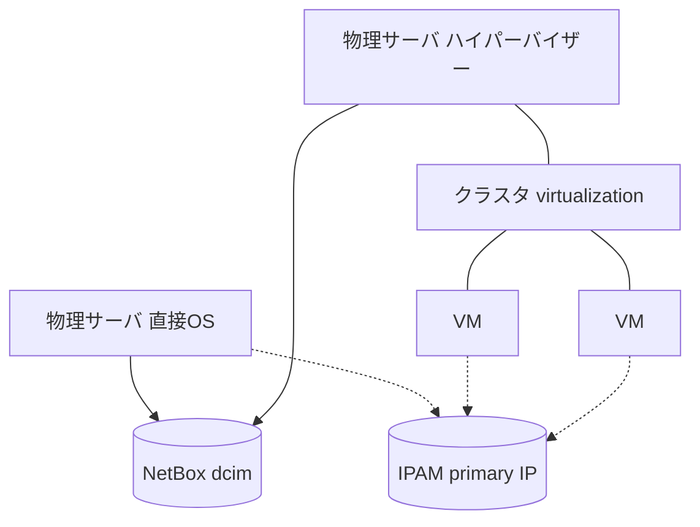

# 07. サーバ・VM 管理設計

物理サーバ(直接 OS 運用 / ハイパーバイザー運用)と、その上の VM の
**一覧と IP アドレス**を管理する。

## 方針

- **一覧の正は NetBox**(dcim + virtualization + IPAM)。Git 台帳には複製しない。
  「一覧を見る」は NetBox の UI / API そのもの。
- n8n の役割は (1) 登録の入口(フォーム)、(2) 仮情報の正式化と IP の回収
  (PC と同じ仕組み)、(3) ハイパーバイザーの実態と NetBox の突合。
- VM は増減が頻繁で**フォーム登録は漏れる前提**で構え、突合(verify)を
  最初から組み込む。

## NetBox でのモデリング

| 対象 | NetBox 上の表現 | 備考 |
|---|---|---|
| 物理サーバ(直接 OS) | dcim/devices、role: `server` | platform に OS(Ubuntu 等)。PC と同じ device モデル |
| 物理サーバ(ハイパーバイザー) | 上記 device + virtualization/clusters のホストとして紐付け | platform にハイパーバイザー(Proxmox / ESXi 等)、cluster type も同製品 |
| VM | virtualization/virtual-machines(cluster 所属) | **資産管理番号なし**(資産はホスト側)。name はクラスタ内一意 |
| IP アドレス | ipam/ip-addresses をインターフェースに割当、primary IP 設定 | PC と同じ。機器一覧・IP 一覧は NetBox の標準ビュー |

## 登録フロー

### server-register(物理サーバ登録)

[PC 登録](02-pc-register.md)と同じ骨格(手入力の仮情報 → `provisional` タグ →
正式化タスク、IP 任意 → 回収タスク)。PC 固有のライセンスタスクは起票しない。

| 項目 | 必須 | 備考 |
|---|---|---|
| 管理者名 / 管理者メール | ✔ | 台帳の `members/` と突合 |
| 資産管理番号 | ✔ | **手入力・同定キー**(`state/servers/<資産管理番号>.yaml`)。未定なら仮の値+「仮」チェック |
| ホスト名 | ✔ | **手入力**。未定なら仮の値+「仮」チェック |
| 機種・モデル / 設置場所 | ✔ | site / rack は任意 |
| 稼働形態 | ✔ | ドロップダウン: 直接OS / ハイパーバイザー |
| OS・ハイパーバイザー種別 | ✔ | NetBox の platform に記録 |
| IPアドレス | − | 任意。未入力なら回収タスク(`blocking: false`) |

稼働形態がハイパーバイザーの場合は、NetBox に**クラスタを自動作成**して
ホストとして紐付ける(以降の VM 登録の受け皿になる)。
タスク管理は `state/servers/<資産管理番号>.yaml`(スキーマは
[state/pcs と同じ](03-service-catalog.md#台帳リポジトリgit)。正式化=blocking、
IP=非blocking)。

### vm-register(VM登録)

軽量なフォーム。**Git 台帳の state は持たない**(継続タスクがないため。
IP 未登録などは監査が NetBox を直接走査して検出する)。

| 項目 | 必須 | 備考 |
|---|---|---|
| 所属クラスタ | ✔ | NetBox のクラスタ一覧から選択 |
| VM 名 | ✔ | クラスタ内で一意(NetBox で重複チェック) |
| 管理者メール / 用途 | ✔ | |
| スペック(vCPU / メモリ / ディスク) | − | 任意 |
| IPアドレス | − | 任意。未登録は weekly-audit の一覧に載る |

VM の変更・削除は NetBox の直接編集でよい(下記の突合が実態との差を検出する)。

### device-update(機器情報更新)

PC・サーバ共通の**機器情報更新フォーム**。
資産管理番号(仮でも可)で対象を指定し、正式な資産管理番号・ホスト名・IP を
部分更新する。動作は [02 の正式化](02-pc-register.md#仮情報と正式化)と同じ
(NetBox 更新+state リネーム/更新+タスク自動クローズ)。VM は対象外
(NetBox 直接編集で足りる)。

## 実態との突合(hypervisor-sync)

サービスカタログの[3軸の考え方](03-service-catalog.md#分類の3軸)を機器管理に
適用し、**まず verify から始めて execute へ昇格**する:

1. **第1段階(verify)**: 定期(日次)にハイパーバイザー API から VM 一覧を
   取得し、NetBox と突合。差分をレポートする:
   - NetBox に未登録の VM(フォーム登録漏れ)
   - 実体が消えたのに NetBox に残っている VM
   - IP・スペックの不一致
2. **第2段階(execute への昇格)**: 突合が安定したら、差分の自動登録・
   自動クリーンアップに昇格する(カタログの `manual` → `api` 昇格と同じ発想。
   まず検出、信頼できたら自動化)。

直接 OS のサーバについても、突合手段が用意できれば(死活監視や
IP スキャンとの照合)同じ枠組みで将来追加できる。

## 監査への追加

weekly-audit のレポート対象に加える:

- `provisional` のままの物理サーバ(正式化の滞留)
- IP 未登録の物理サーバ・VM(NetBox を直接走査)
- hypervisor-sync が検出した差分の放置

## 未確定事項

- **ハイパーバイザー製品**(Proxmox / ESXi / Hyper-V 等)。hypervisor-sync の
  コネクタ実装と NetBox の cluster type は製品で決まる。実装フェーズまでに確定する。
