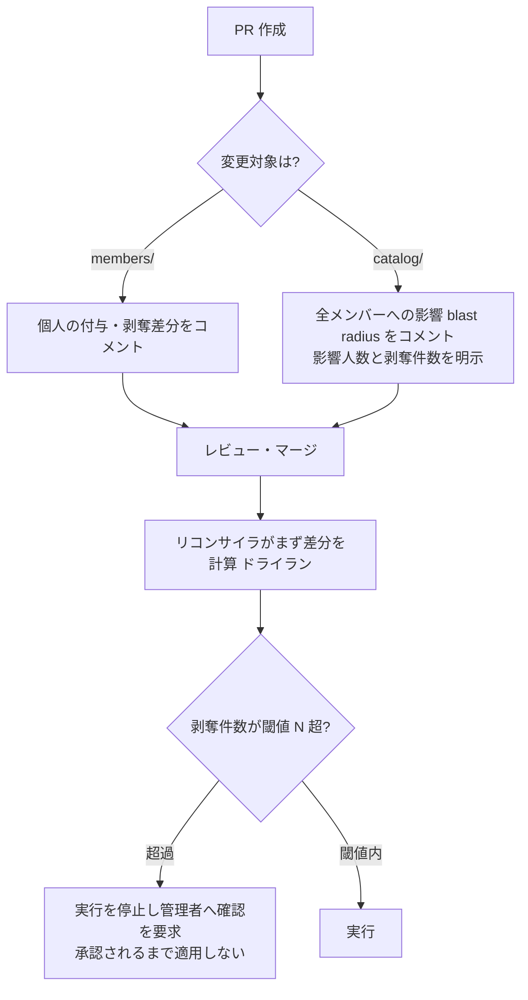

# 08. 統制と安全装置

各フローに属さない**横断的な統制**をここに集約する。
個々のフローの仕様は [01](01-member-lifecycle.md)〜[07](07-servers.md) にあり、
このドキュメントは安全設計の全体像の読み口として使う。

## fail-open / fail-closed 方針

自動化の失敗が「アクセスが残る側(fail-open)」と「アクセスが止まる側
(fail-closed)」のどちらに倒れるかを、意図をもって決める。
**受容した fail-open は、リスクを認識したうえでの選択であることを明記する。**

| 事象 | 倒れる方向 | 意図と手当て |
|---|---|---|
| 付与の実行に失敗 | fail-closed(付与されない) | 日次リコンサイルが自動再試行。業務が止まるため気づかれやすい |
| 剥奪の実行に失敗 | fail-open(付与が残る) | desired ≠ state が残り続けるため、日次リコンサイルの再試行と weekly-audit で必ず浮上する。**気づかれにくい方向なので監査で補う** |
| **協力会社の契約満了(`contract_until` 超過)で更新も削除もされない** | **fail-open(アクセスが残る)** | **意図的な受容**。業務継続を優先し、契約更新手続きの遅延でアクセスが自動で切れることを避ける。代わりに、自動生成された削除 PR は失効クローズの対象外とし、エスカレーションを継続する(→ [01](01-member-lifecycle.md))。この受容は**定期再認定**(後述)を前提条件とする |
| 従業員が退職したが削除申請が出ない | fail-open | 全社 IdP 突合(入手可能な場合)と定期再認定で検出する |
| リコンサイラが大量剥奪を試行 | fail-closed(実行を止める) | サーキットブレーカー(後述)。誤剥奪の一斉実行より、停止して人が確認する方を選ぶ |
| n8n 自体の停止 | fail-open(すべての自動処理が止まる) | 外部ハートビートで検知(後述)。**この検知がないと fail-open に気づけない** |
| ハイパーバイザーと NetBox の差分 | 報告のみ | 自動是正しない(→ [07](07-servers.md)) |

## 脅威モデルと残余リスク

### 認識している残余リスク: n8n は統制のバイパス経路である

台帳側では「申請者≠承認者」「復旧困難な変更は2名承認」を設計しているが、
**n8n はこれらを技術的に迂回できる**:

- Keycloak の `manage-users`(ユーザー作成・停止・グループ変更)
- GitHub の `admin:org`(Org 招待・削除・Team 操作)
- 台帳リポジトリのブランチ保護をバイパスできる bot Token

したがって **n8n のワークフローを編集できる人は、PR 承認プロセスを通さずに
同じ操作を実行できる**。これは自動化を1箇所に集約する以上、原理的に消せない。
「台帳に統制がある」ことをもって権限操作が統制されていると考えるのは誤りで、
**n8n の管理者権限は、台帳の承認者と同等以上の特権として扱う**。

### 縮小策

| 対策 | 内容 |
|---|---|
| n8n 自体のアクセス制御 | n8n の管理者・編集者を最小限にし、SSO 配下に置く。誰がワークフローを編集できるかを台帳と同じ厳格さで管理する |
| **ワークフロー定義の監査** | ワークフロー定義を日次でエクスポートして専用リポジトリにコミットし、差分をレポートする。**n8n 自身を consistency-audit の対象にする**ことで、承認を経ないワークフロー改変を検出可能にする |
| **bot の書き込み範囲の強制** | 「bot は `state/` しか書かない」は規約にすぎず技術的強制ではない。GitHub Rulesets のパス制限で、bot Token が `members/` `catalog/` を直接書けないよう強制する |
| credential の最小権限 | Keycloak はサービスアカウントに `manage-users` / `query-*` のみ。GitHub は Org 管理用と台帳 bot 用の Token を分ける(→ [05](05-environment.md)) |
| `N8N_ENCRYPTION_KEY` の管理 | credential 復号鍵。紛失で全 credential が失われ、漏洩で全 credential が復号される。バックアップ対象かつ秘密情報として管理する(→ [05](05-environment.md)) |
| 監査ログの分離 | Keycloak・GitHub 側の監査ログは n8n から改変できない。**n8n を信頼しない検証手段**として、突合の最終的な根拠に使う |

## リコンサイラの安全装置

リコンサイラは desired と state の差分で動くため、**マトリクスやカタログの
1行の編集ミス、差分計算のバグが全メンバーの一斉剥奪に直結する**。
メンバー PR には CI の差分プレビューが効くが、`catalog/` の変更は影響範囲が
広いため、次の3段構えで守る。

- **影響範囲(blast radius)プレビュー**: `catalog/`(サービスカタログ・役割
  マトリクス・チームマトリクス)を変更する PR には、CI が
  **影響を受けるメンバー数と、付与/剥奪の総件数**をコメントする。
  メンバー1人の PR と同じ感覚でカタログをマージさせない。
- **サーキットブレーカー**: 1回の実行で**剥奪が閾値 N 件(既定 5)を超える**場合、
  実行を停止して管理者に確認を求める。承認されるまで適用しない。
  正常な一括処理(組織改編など)は、承認を経て実行するか閾値を一時的に上げる。
- **ドライラン(plan)モード**: 実行せず差分だけを出力するモード。
  カタログ変更前の影響確認と、障害調査に使う。

## ドリフト(フロー外変更)への対応方針

consistency-audit が「台帳にない付与」「台帳にあるのに存在しない付与」を
検出した後の扱いを定める。

- **自動是正はしない(報告のみ)**。理由: 緊急対応で管理者が手動停止した
  アカウントを、リコンサイラが desired に従って**再有効化してしまう**危険が
  あるため。安全側(アクセスを止める方向)への手動変更を自動で覆さない。
- 報告を受けた管理者は次のいずれかを選ぶ:
  1. **台帳を実態に合わせる**(その変更が正当だった場合)— 台帳への PR。
  2. **実態を台帳に合わせる**— bot が是正**提案 PR** を自動作成し、
     レビュー・マージを経てリコンサイラが適用する。
- いずれの経路でも**必ず PR を通す**ため、是正そのものにも承認と履歴が残る。

## break-glass(緊急時の直接操作)

インシデント対応など、PR のリードタイムを待てない場合の正規手順を定める。
**手順を用意しないと、緊急時に無手順の直接操作が発生し、監査が「異常」として
誤報告する**ため、あらかじめ定義する。

1. Keycloak(および必要なら GitHub)を管理画面・API で**直接停止する**。
   アクセス遮断を最優先し、台帳は後追いでよい。
2. 実施者は**その場で管理者へ通知**する(notify の緊急チャネル)。
3. **24時間以内に台帳へ追随 PR** を出す(`status: left` または該当 grant の削除)。
   この PR はレビューを経て、事後承認として記録される。
4. consistency-audit は、break-glass として記録された変更を
   「未追随の異常」ではなく「追随待ち」として報告する。
   24時間を過ぎても追随 PR がなければエスカレーションする。

## 定期再認定(recertification)

半期ごとに、**全メンバーの権限がまだ必要か**を確認する。
個別の申請フローが取りこぼした変化(退職・異動・一時的権限の常態化)を
まとめて回収する、最終のバックストップ。

| 項目 | 内容 |
|---|---|
| 頻度 | 半期(年2回) |
| 対象 | `status: active` の全メンバー。役割・チーム・`extra_grants` |
| 確認者 | 従業員は上長、協力会社メンバーは sponsor |
| 方式 | 対象者一覧を確認者へ送り、「継続 / 変更 / 削除」を回答してもらう。変更・削除は bot が台帳 PR を自動作成し、通常の承認フローに乗せる |
| 未回答 | リマインド後、エスカレーション。**未回答をもって自動削除はしない**(fail-open の受容と整合) |

この再認定は、次の3つの穴を同時に塞ぐ:

- 従業員退職の検知(全社 IdP 突合が入手できない場合の代替)
- 役割・チームマトリクスの誤り(誰も気づかない過剰付与)
- `extra_grants` の常態化(`review_until` を過ぎた個人例外)

## 台帳リポジトリの個人情報

`members/` には氏名・メールアドレス・所属会社・契約期限が載り、
削除 PR の時点で退職・契約終了の予定が可視になる。
`status: left` のファイルは残り続け、git 履歴からは消えない。

| 論点 | 方針 |
|---|---|
| 閲覧権限 | 台帳リポジトリは**プロジェクト内の限定公開**とし、Org 全体には公開しない。閲覧者の範囲を明示的に管理する |
| 載せる属性の最小化 | 権限判断に不要な個人情報(生年月日・住所・雇用条件など)は**載せない**。氏名・メール・affiliation・契約期限に限る |
| 保持期間 | `status: left` のファイルは**在籍中の権限履歴の証跡**として保持する。保持期間の上限は組織の個人情報保護方針に従って定める(未定。運用開始前に確定させる) |
| 削除要求への対応 | git 履歴からの完全削除は履歴改変を伴い監査証跡を損なうため、**要求があった場合の手順を事前に定める**必要がある(未定) |

### 「git log が監査証跡」の前提条件

git 履歴を監査証跡として主張するには、次が満たされている必要がある:

- **force push の禁止**(ブランチ保護)。履歴の書き換えを防ぐ。
- **bot Token 侵害時の改竄可能性**を認識する。bot は保護をバイパスできるため、
  bot 侵害時には履歴に偽の記録を残せる。したがって git 履歴は
  **Keycloak・GitHub 側の監査ログと突き合わせて初めて完全な証跡**になる。
- 署名コミット(可能なら)による作成者の保証。

## 監視の監視(デッドマンスイッチ)

キルスイッチ・リマインド・監査はすべて**単一の n8n インスタンスの
Schedule Trigger に依存**している。n8n が静かに停止すると、それらが止まったこと
自体に誰も気づけない(fail-open のうち最も危険な形)。

- **外部ハートビート**: n8n の日次ワークフローから外部の死活監視サービス
  (または別ホストの簡易な監視)へ ping を送り、**一定時間 ping が途絶えたら
  外部側から管理者へ通報する**。n8n の外に検知の起点を置くことが要点で、
  n8n 自身に「自分が止まったこと」を報告させない。
- **バックアップとリストア**: n8n の DB(ワークフロー・credential・実行履歴)、
  Keycloak の DB、NetBox の DB を定期バックアップする。
  `N8N_ENCRYPTION_KEY` を**別管理でバックアップ**する(鍵がないと credential は
  復元できない)。リストア手順を実際に試して手順書に残す。
- 台帳は GitHub にあるためバックアップは分散しているが、
  リポジトリのミラーを別途保持すると復旧が早い。

## 監査頻度

| 監査 | 頻度 | 備考 |
|---|---|---|
| 高リスク項目(Org owner 権限、Keycloak の管理者グループ、`admin` 役割) | **日次** | 管理画面での直接付与が最大1週間見えないのは遅すぎるため、週次から引き上げる |
| consistency-audit(通常のメンバーシップ突合) | 週次 | |
| weekly-audit(未収束・期限超過の集計) | 週次 | |
| ワークフロー定義の差分監査 | 日次 | 上記「脅威モデル」の縮小策 |
| 定期再認定 | 半期 | |
| verify が `human` / `none` のサービスの棚卸し | 四半期 | → [01](01-member-lifecycle.md) |
