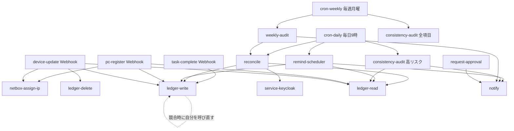

# 09. ワークフロー実装

**保守する人向け。** 実装されたワークフローが実際にどう組まれているかを説明する。

- **なぜそうしたか** → [00](00-overview.md)〜[08](08-safeguards.md)
- **どう使うか** → [運用ハンドブック](../handbook.html)
- **どう作られているか** → このドキュメント

n8n の癖に起因する実装上の判断が多いため、
[05 の「構築時に判明した制約」](05-environment.md#構築時に判明した制約検証済み)と
あわせて読むこと。

## 一覧

`workflows/*.json` として Git 管理し、`./scripts/deploy-workflows.py` で反映する。
ID は固定値(変えると再インポートで重複する)。

| ワークフロー | ID | 起動 | 呼び出す先 |
|---|---|---|---|
| **reconcile** | `reconcile0000001` | サブ | ledger-read / ledger-write / コネクタ(動的) |
| **service-keycloak** | `svckeycloak00001` | サブ | — |
| **ledger-read** | `ledgerread00001` | サブ | — |
| **ledger-write** | `ledgerwrite00001` | サブ | 自分自身(競合時の再試行) |
| **ledger-delete** | `ledgerdelete0001` | サブ | — |
| **notify** | `notify0000000001` | サブ | — |
| **request-approval** | `reqapproval00001` | サブ | notify |
| **remind-scheduler** | `remindsched00001` | サブ / `POST /webhook/remind-run` | ledger-read / ledger-write / notify |
| **task-complete** | `taskcomplete0001` | `GET /webhook/task-complete` | ledger-read / ledger-write |
| **pc-register** | `pcregister000001` | サブ / `POST /webhook/pc-register` | ledger-read / ledger-write / netbox-assign-ip |
| **device-update** | `deviceupdate0001` | サブ / `POST /webhook/device-update` | 上記 + ledger-delete |
| **netbox-assign-ip** | `nbassignip00001` | サブ | — |
| **weekly-audit** | `weeklyaudit00001` | サブ / `POST /webhook/weekly-audit` | reconcile(ドライラン)/ ledger-read / notify |
| **consistency-audit** | `consistaudit0001` | サブ / `POST /webhook/consistency-audit` | ledger-read / notify |
| **cron-daily** | `crondaily0000001` | 定期(毎日9時) | reconcile → remind-scheduler → consistency-audit(高リスク) |
| **cron-weekly** | `cronweekly000001` | 定期(毎週月曜9時) | weekly-audit → consistency-audit(全項目) |
| **form-member-request** | `formmember00001` | Form([メンバー申請](http://localhost:5678/form/f6b2d9a4-1c73-4e58-8a90-3d5f2b7c4e18)) | ledger-read / ledger-propose |
| **form-pc-register** | `formpcregist0001` | Form([PC登録](http://localhost:5678/form/a9d4f7b2-5e81-4c36-9f20-6b3a1d8e5c74)) | pc-register |
| **ledger-propose** | `ledgerpropose001` | サブ | — (台帳への PR 作成) |
| **probe-yaml** | `probeyaml000001` | サブ | — (Code ノードで YAML が使えることの確認用) |

### 未実装

| 予定 | 状況 |
|---|---|
| `service-github` | GitHub Team の反映。**Organization が必要**で検証環境では動かせない。reconcile は「未実装コネクタ」として可視化する |
| `server-register` / `vm-register` / `hypervisor-sync` | サーバ・VM 登録(→ [07](07-servers.md))。ハイパーバイザー製品が未確定 |
| `recertification` / `heartbeat` / `workflow-export-audit` | 安全装置(→ [08](08-safeguards.md)) |


## 呼び出し関係



## 主要フローの構成

### reconcile — 差分を計算して適用する

宣言的モデルの心臓部。追加・役割変更・チーム異動・削除はすべてこの1本で処理する。

```
カタログ読み取りの入力 → カタログを読む(ledger-read)
  → メンバー読み取りの入力 → メンバーを読む(ledger-read)
  → 差分を計算する
  → [適用するものがあるか]
       ├ あり → コネクタを実行(動的ID) ┐
       └ なし → コネクタ実行なし ──────┤
  → state への patch を作る ← ─────────┘
  → [書き込みが必要か] → state を書き込む(ledger-write) → サマリを返す
```

要点:

- **あるべき grant** = 役割マトリクス ∪ ⋃チームマトリクス ∪ `extra_grants`。
  `status: left` なら空集合。これと `state.grants` を比べた差が実行対象。
- **コネクタ名 → ワークフロー ID の対応表**は「差分を計算する」ノード内の
  `CONNECTORS` にある。コネクタを増やしたらここに1行足す。
- **サーキットブレーカー**: 剥奪が `REVOKE_CIRCUIT_BREAKER`(既定5)を超えると
  適用前に例外で止まる。
- **ドライラン**: 入力 `{dryRun: true}` で何も適用せず計画だけ返す。
  weekly-audit が未収束の検出に使う。
- **0件でも止まらない工夫**: n8n はアイテム0件で後続が実行されないため、
  分岐の両側を合流させ、書き込み対象が無いときはマーカー1件を流している。

### service-keycloak — コネクタの型

他のコネクタを作るときの参考になる構造。

```
入力を検証する → ユーザーを作成(既存なら409。onError で続行)
  → グループ一覧 → グループ表を作る → ユーザーを取得
  → 操作を組み立てる → Keycloak を更新 → 結果を返す
```

要点:

- **「1操作1アイテム」に展開**して1つの HTTP ノードで処理する。
  n8n の HTTP ノードはアイテムごとに実行されるため、ループ辺が要らない。
- 有効/無効の設定は**常に**アイテムに含めるので、アイテムが0件にならない。
- **冪等**: 作成は409を許容し、グループ操作は差分のみ。同じ入力で再実行しても
  「付与0件・剥奪0件」になる。
- 入出力は[03 のハンドラIF](03-service-catalog.md#ハンドラの入出力インターフェース)に従う。

### ledger-read / ledger-write / ledger-delete — 台帳アクセス

台帳の格納先を知っているのはこの3本だけ(Repository パターン)。
呼び出し側は `kind` と `id` しか知らない。

- **ledger-read**: `{kind, id?}` → ディレクトリ一覧 → 各ファイル取得 →
  base64 復号 → YAML パース → `desired` と `state` を id で突き合わせ。
  応答自身の `path` / `sha` で判別するので、ノード間のインデックス対応に依存しない。
- **ledger-write**: 読んだ `sha` を付けて PUT(楽観的排他)。競合(409/422)なら
  **自分自身を呼び直して**読み直し・再適用(上限3回)。ループ辺を使わない。
  patch の `null` はキー削除(RFC 7386 と同じ規約)。
- **ledger-delete**: 資産管理番号の正式化でファイル名が変わるときに旧ファイルを消す。

### remind-scheduler — 催促と事後検証

```
読み取りの入力 → 台帳を読む(members) → PC読み取りの入力 → PC台帳を読む(pcs)
  → NetBox の実態を取得 → リマインド対象を選ぶ
  → [送るものがあるか] → 通知を送る(notify)
  → state 更新を組み立てる → [書き込みが必要か] → state を書き込む → サマリ
```

要点:

- **verify: api のタスクは実サービスを見て自動クローズ**する。
  `pc-official-info` は provisional タグの解消、`pc-ip` は primary_ip4 の有無で判定。
  これにより「フォーム経由でも NetBox 直接編集でも同じように完了になる」。
- NetBox 側の値を state に**追随**させる(直接編集の取り込み)。
- `blocking: false` のタスクはリマインドするがエスカレーションせず、
  親の `active` 判定も妨げない。

### pc-register / device-update — 機器の登録と正式化

- **pc-register**: 重複チェック(名前・資産管理番号)→ NetBox 登録
  (仮情報なら `provisional` タグ)→ IP 割当 → 必須ソフトカタログから
  タスク起票 → `state/pcs/<資産管理番号>.yaml`。
- **device-update**: 対象を資産管理番号で特定 → 重複チェック(**自分自身を除外**)
  → NetBox 更新(タグ除去)→ IP 割当 → state 更新。
  資産管理番号が変わると**ファイル名も変わる**ため、新しい id で全置換して
  旧ファイルを ledger-delete で消す。
- **タスクは閉じない**。完了判定は remind-scheduler の事後検証に任せ、
  NetBox 直接編集と扱いを揃える。

### 申請フォーム

`form-member-request` と `form-pc-register` は**入力を既存フローの形に変換するだけ**の
薄い層。検証・重複チェック・登録は呼び先(`pc-register` / `ledger-propose`)が行う。
Webhook から直接呼ぶ経路と処理を共通にするため。

- **メンバー申請**: 入力から `members/<id>.yaml` を組み立て、`ledger-propose` が
  ブランチ+コミット+PR を作る。**bot は desired を直接書かない**(必ず PR)。
  追加なのに既存、変更・削除なのに不在、といった不整合はこの時点で止める。
- **PC 登録**: 日本語ラベルを `pc-register` の入力形式に写すだけ。

URL は `/form/<webhookId>` 固定(カスタムパスを持てないため)。
webhookId は JSON に書いてあるので、再インポートしても URL は変わらない。

| フォーム | URL |
|---|---|
| メンバー申請 | http://localhost:5678/form/f6b2d9a4-1c73-4e58-8a90-3d5f2b7c4e18 |
| PC 登録 | http://localhost:5678/form/a9d4f7b2-5e81-4c36-9f20-6b3a1d8e5c74 |

### 監査

- **weekly-audit**: reconcile をドライランで呼んで未収束を取得し、
  タスクの滞留・失敗・PC の状態・契約期限を集計して管理者へ通知する。
  あるべき grant の計算を二重実装しないための構成。
- **consistency-audit**: `{scope: 'high-risk'|'full'}`。Keycloak のユーザーと
  グループ所属、NetBox の機器を台帳と突合する。**検出のみで自動是正しない**。
  HTTP ノードのアイテム単位実行で後続が複数回走るため、
  指摘は `Set` で一意化している。

## 実装の決まりごと

新しくワークフローを作る・直すときに守ること。

| 決まり | 理由 |
|---|---|
| JSON に top-level の `id` を必ず付ける | 無いと再インポートで重複する |
| UI で編集しない。JSON を直して `deploy-workflows.py` | 定義を Git に残すため([08](08-safeguards.md) のワークフロー定義監査に接続) |
| 設定値は `$env` から読む | 環境固有の値を JSON に埋め込まない |
| 認証が要る通信は HTTP Request ノード | Code ノードは `helpers.httpRequestWithAuthentication` を使えない |
| ノード間をインデックスで対応付けない | HTTP ノードが配列をアイテムに分割するため件数がずれる。応答自身が持つ ID で判別する |
| Execute Workflow は `mode: "each"` | 既定は全アイテムをまとめて渡すため、`$input.first()` しか見ないサブワークフローだと取りこぼす |
| 0件になりうる分岐は合流させる | アイテム0件だと後続が実行されない。マーカー1件を流して必ず最後まで到達させる |
| Webhook を持つフローで Execute Workflow の宛先を式にしない | **有効化に失敗し Webhook が登録されない**(エラーも出ない) |
| ループは自分自身の呼び出しで書く | ループ辺は状態の持ち回りが必要で壊れやすい。再帰なら実行ごとにコンテキストが独立する |

## 検証のしかた

```bash
./scripts/deploy-workflows.py                              # 反映(インポート→有効化→再起動)
./scripts/run-workflow.py ledger-read '{"kind":"members"}' # 素のサブワークフロー(CLI)
./scripts/run-workflow.py pc-register '{...}' --webhook pc-register  # 入口フロー(Webhook)
```

待機を含むフロー(request-approval)や多段のサブワークフロー呼び出しは
**CLI では動かない**。Webhook を持つものは `--webhook` で、持たないものは
一時的な Webhook ワークフローを作って稼働中インスタンスに実行させる。

送信されたメールは Mailpit(http://localhost:8025)で確認する。
